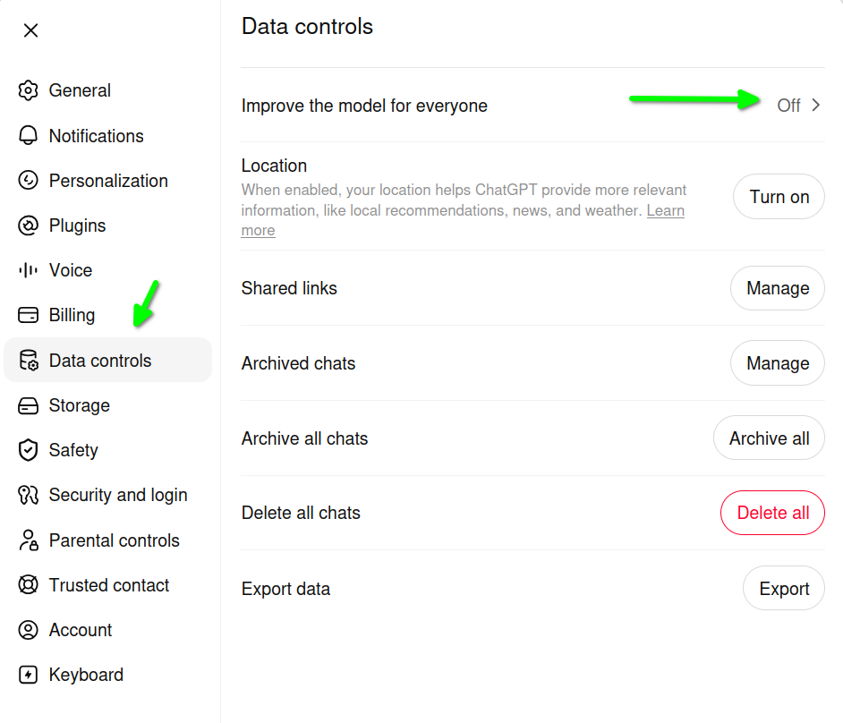

# AI

## Data control

### ChatGPT

Bedąc zalogowanym na koncie z lewego dolnego rogu klikamy na ikonę Profilu i wybiramy opcję "Settings".

Następnie "Data controls" i wyłączamy opcję "Improve the model for everyone".

