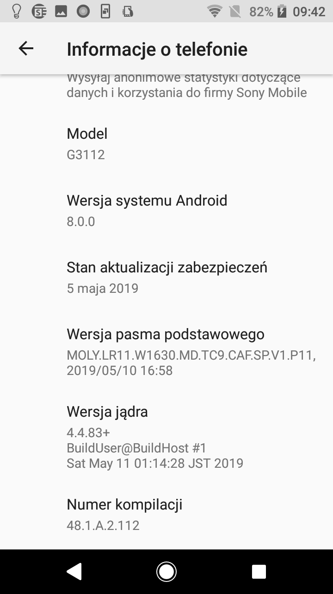
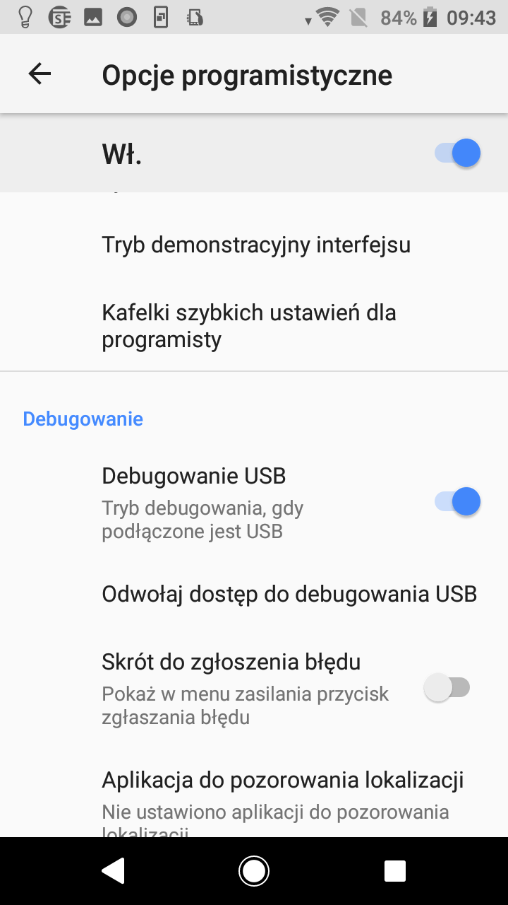
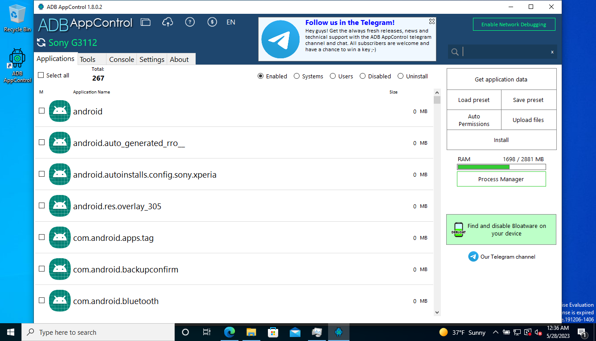

# Android debloating

Debloating Androida to proces usuwania aplikacji zainstalowanych domyślnie przez producenta telefonu.
Aplikacja [ADB AppControl](https://adbappcontrol.com/en/) umożliwia nam skasowanie aplikacji, których nie można usunąć korzystając z systemowych narzędzi. Dodatkowo nie wymaga, aby nasz telefon był zrootowany. 

Po pobraniu i zainstalowaniu aplikacji w systemie Windows, na telefonie włączamy tryb programisty i debugowanie USB.

Debugowanie USB można najczęściej włączyć poprzez przejście do "Ustawienia", a następnie znaleźć pozycję odpowiedzialną za informacje o oprogramowaniu np. "Informacje o telefonie".
Następnie odnaleźć pole odpowiedzialne za numer wersji systemu np. "Numer kompilacji". Pole te należy dotknąć siedem razy, po tym powinien wyświetlić się komunikat, że Opcje programisty zostały odblokowane.

Wracamy do Ustawień i tym razem powinniśmy mieć widoczną pozycję "Opcje programistyczne". Dotykamy te pole, a następnie włączamy "Debugowanie USB".

W aplikacji ADB AppControl możemy kliknąć w przycisk "Find and disable bloatware on your device", albo skorzystać z wyszukiwarki.

