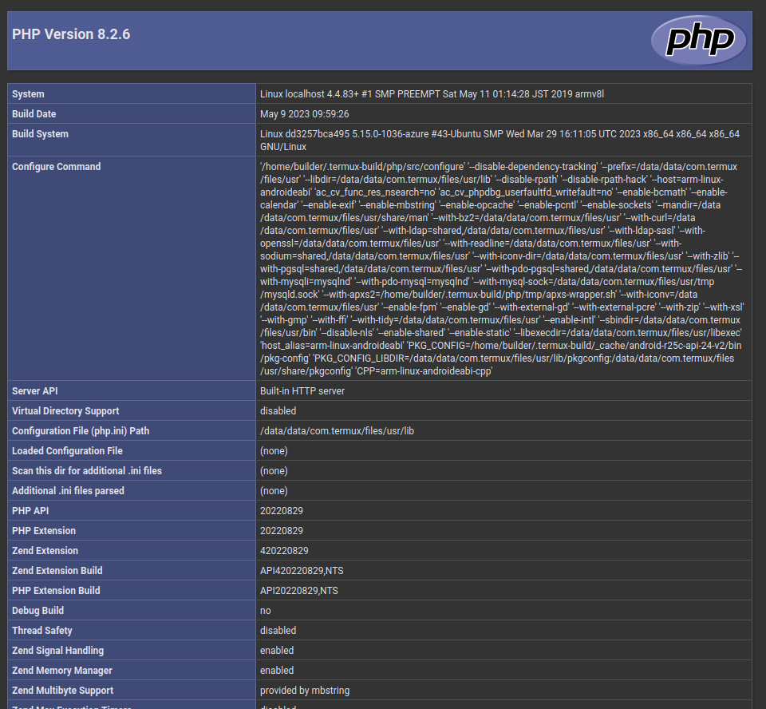

# Android termux

Na telefon pobieramy plik APK Termux ze strony [GitHub](https://github.com/termux/termux-app/releases).
W moim przypadku [termux-app_v0.118.0+github-debug_armeabi-v7a.apk](https://github.com/termux/termux-app/releases/download/v0.118.0/termux-app_v0.118.0+github-debug_armeabi-v7a.apk)
Następnie jeśli nie mamy włączonej opcji instalacji aplikacji APK z zewnętrznych źródeł, to musimy to zrobić.  W moim przypadku po pobraniu pliku przez Firefox Focus mogłem przejść do ustawień i zezwolić tej aplikacji na instalowanie plików APK.

Następnie uruchamiamy aplikacje Termux. 
W oknie konsoli wpisujemy `pkg update` a następnie `pkg install php`.
Jeśli nie wywołamy polecenia `pkg update` to podczas startu PHP otrzymamy błąd, że biblioteka `libopenssl` nie została znaleziona.

Tworzymy także nasz plik z kodem PHP np. wywołując polecenie `echo -e "<?php\n phpinfo();" > index.php`.
Możemy także zainstalować pakiet vim, aby edytować plik.

Następnie wywołujemy polecenie `ifconfig`, aby sprawdzić adres IP naszego interfejsu WiFi.
W moim przypadku adres IP to `192.168.50.200`.

Odpalamy wbudowany serwer HTTP w PHP poleceniem podając adres IP telefonu i port 4200 `php -S192.168.50.200:4200`.
Na innym urządzeniu możemy uruchomić przeglądarkę i wejść na stronę `192.168.50.200:4200`.

[This blog is hosted on my Android phone](https://androidblog.a.pinggy.io/)

## adbe

[adbe](https://github.com/ashishb/adb-enhanced) to nadrzędzie ułatwiające wykonanie wielu czynności podczas testowania i tworzenia aplikacji dla Android.
Do działania wymaga narzędzia `adb` w moim przypadku dostarczanego w ramach pakietu `android-tools`. 
Dzięki adbe możemy lokalnie utworzyć skrypt PHP i wrzucić go do Termux, bez potrzeby korzystania z klawiatury na telefonie.

Telefon musi mieć włączony tryb Debugowania USB. Podłączamy go do portu USB w komputerze i akceptujemy klucz na telefonie.
Następnie w konsoli wyświetlamy odnalezione urządzenia - `adbe devices`. Powinniśmy widzieć podłączony telefon.

Następnie wyświetlamy zainstalowane aplikacje `adbe apps list third-party`.
Jeśli mamy już zainstalowaną aplikację Termux to zobaczymy ją pod nazwą "com.termux".
W przeciwnym razie pobieramy plik APK i instalujemy `adbe install <sciezka/do/pliku/apk>`.
Uruchamiamy aplikację na telefonie, albo wywołujemy polecenie `adbe start com.termux`.

Wyświetlamy zawartość katalogu aplikacji `adbe ls /data/data/com.termux/files/home`. Do tego katalogu skopiujemy nasz skrypt PHP.
Tworzymy skrypt PHP i zapisujemy go pod dowolną nazwą np. `index.php`. Kopiujemy plik wywołując polecenie `adbe push <sciezka/Do/Skryptu/PHP> /data/data/com.termux/files/home/index.php`
Plik powinien zostać skopiowany i ponowne wywołanie polecenia `adbe ls /data/data/com.termux/files/home` powinno nam go już zwrócić.

Możemy także w aplikacji Termux na telefonie odpalić polecenie `ls -la ~`, aby przekonać się, że plik istnieje.
