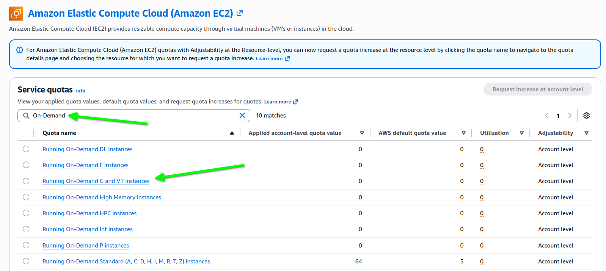
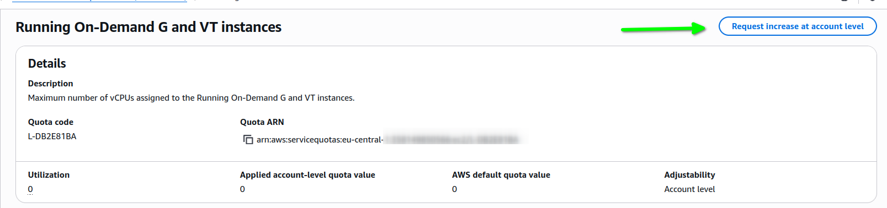

# AWS EC2 VcpuLimitExceeded

Podczas tworzenia maszyny wirtualnej EC2 typu `g4dn.xlarge` otrzymałem błąd:

>  Error: creating EC2 Instance: operation error EC2: RunInstances, https response error StatusCode: 400, RequestID: 33437c55-9273-4181-813e-d3c7a5cc49af, api error VcpuLimitExceeded: You have requested more vCPU capacity than your current vCPU limit of 0 allows for the instance bucket that the specified instance type belongs to. Please visit http://aws.amazon.com/contact-us/ec2-request to request an adjustment to this limit.

Oznacza to, że musimy zwiększyć limity vCPU dla odpowiedniej klasy instancji.

Przechodzimy na stronę: [Amazon Elastic Compute Cloud (Amazon EC2) | Quotas list | AWS Service Quotas](https://eu-central-1.console.aws.amazon.com/servicequotas/home/services/ec2/quotas)

Wyszukujemy frazę "On-Demand".
Na przefiltrowanej liście znajdujemy limit "Running On-Demand G and VT instances".
Klikamy w nazwę limitu (Quota name).



Na stronie szczegółów limitu klikamy przycisk: "Request increase at account level"



Jeśli chcemy korzystać z instancji Spot, wykonujemy analogiczne kroki, ale wyszukujemy limit: "All G and VT Spot Instance Requests"

[EC2 instance creation - vCPU limit issue](https://repost.aws/questions/QUlTBTbSCeRuC6-5HxxHvn4w/ec2-instance-creation-vcpu-limit-issue)

[You have requested more vCPU capacity than your current vCPU limit of 0](https://stackoverflow.com/questions/68347900/you-have-requested-more-vcpu-capacity-than-your-current-vcpu-limit-of-0)

## Szukanie obrazu AMI:

```
aws ec2 describe-images --owners 099720109477 --filters 'Name=name,Values=ubuntu/images/hvm-ssd-gp3/ubuntu-noble-24.04-amd64-server-*' --query 'Images | sort_by(@, &CreationDate) | [].Name' --output table
```

## Plik terraform

```
terraform {
  required_providers {
    aws = {
      source = "hashicorp/aws"
      version = "6.27.0"
    }
  }
#   encryption {
#     method "unencrypted" "migrate" {}
#     key_provider "pbkdf2" "mykey" {
#       passphrase = var.passphrase
#     }
#
#     method "aes_gcm" "new_method" {
#       keys = key_provider.pbkdf2.mykey
#     }
#
#     state {
#       method = method.aes_gcm.new_method
# #       enforced = true
#        fallback {
#          method = method.unencrypted.migrate
#        }
#     }
#   }
}

provider "aws" {
  region = "eu-central-1"
}


variable "passphrase" {
   type = string
   sensitive = true
}
variable "ec2_key_name" {
    default = "aws=dell"
}
variable "aws_az" {
    default = "eu-central-1b"
}


locals {
  ec2_key_name = var.ec2_key_name
  ec2_ami_id = data.aws_ami.ubuntu.id
  ec2_app_instance_type = "t2.micro"
}

data "aws_vpc" "default" {
  default = true
}
data "aws_subnets" "public_az" {
  filter {
    name   = "vpc-id"
    values = [data.aws_vpc.default.id]
  }

  filter {
    name   = "availability-zone"
    values = [var.aws_az]
  }

  filter {
    name   = "map-public-ip-on-launch"
    values = ["true"]
  }
}
data "aws_ami" "ubuntu" {
  most_recent = true

  filter {
    name   = "name"
    values = ["ubuntu/images/hvm-ssd-gp3/ubuntu-noble-24.04-amd64-server-*"]
  }

  filter {
    name   = "virtualization-type"
    values = ["hvm"]
  }

  owners = ["099720109477"] # Canonical
}

# Create security group and ec2
resource "aws_security_group" "ai" {
  name = "ai-ssh"
  description = "SSH only"
  vpc_id = data.aws_vpc.default.id

  # Allow SSH
  ingress {
    from_port = 22
    protocol = "tcp"
    to_port = 22
    cidr_blocks = ["0.0.0.0/0"]
  }

  egress {
    from_port       = 0
    to_port         = 0
    protocol        = "-1"
    cidr_blocks     = ["0.0.0.0/0"]
  }

  tags = {
    Name ="ai-sg"
    Project = "ai"
  }

  lifecycle {
    create_before_destroy = true
  }
}

resource "aws_instance" "ai" {
  ami = local.ec2_ami_id
  instance_type = "g4dn.xlarge"
  subnet_id = data.aws_subnets.public_az.ids[0]
  key_name = local.ec2_key_name

  vpc_security_group_ids = [
    aws_security_group.ai.id
  ]

  root_block_device {
    delete_on_termination = true
    volume_size = 50
    volume_type = "gp2"
  }

  tags = {
    Name ="AI"
    OS = "Ubuntu"
    Project = "ai"
  }

  depends_on = [ aws_security_group.ai ]
}

output "public_ip" {
  description = "Public IP"
  value       = aws_instance.ai.public_ip
}

```
