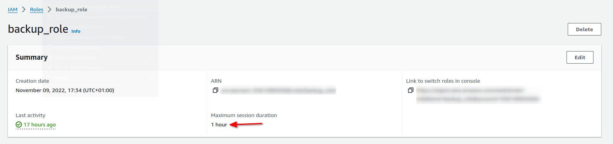

# AWS IAM

IAM Group - zawiera tylko użytkowników (nie można dodawać grup). Użytkownik może należeć do wielu grup.

IAM User - użytkownik organizacji

IAM Role - pozwala uwierzytelniać zasoby AWS, np. instancję EC2. Rola IAM ma własną politykę uprawnień. Jest jak użytkownik IAM, ale bez hasła czy klucza API.

IAM Policy - dokument JSON, który określa uprawnienia dla użytkownika, grupy lub roli. Istnieją dwa typy zasad: managed policy i inline policy.
Managed policy to zasady przeznaczone dla tych, co chcą je ponownie wykorzystać (np. AWS managed policy).

Polityka IAM to dokument JSON z kluczami Sid, Effect, Principal, Action i Resource.

Domyślnie każdy użytkownik, grupa, rola IAM am zablokowany dostęp do zasobu. Dostęp do zasobu musi być jawnie zdefiniowany w polityce. Dołączona polityka z jawną regułą zablokowania dostępu
jawnie blokuje dostęp do zasobu.

Dodatkowe usługi które mogą nam pomóc w określeniu uprawnień Access advisor i credential report.

## Linki

[IAM Credentials Report](https://docs.aws.amazon.com/IAM/latest/UserGuide/id_credentials_getting-report.html#getting-credential-reports-console)

[IAM Access Advisor](https://docs.aws.amazon.com/IAM/latest/UserGuide/what-is-access-analyzer.html)

[Actions, resources, and condition keys for AWS services](https://docs.aws.amazon.com/service-authorization/latest/reference/reference_policies_actions-resources-contextkeys.html)

## STS assume-role

Tworzymy role i użytkownika w AWS. Następnie generujemy token API do nowo utworzonego konta i konfigurujemy narzędzie AWS CLI pod utworzone konto.

Wywołując polecenie `aws sts get-caller-identity` może potwierdzić, że polecenia AWS CLI są wywoływane z uprawnieniami utworzonego użytkownika.

Generujemy tymczasowy token podając ARN roli i własną nazwę sesji - `aws sts assume-role --role-arn "arn:aws:iam::<ACCOUNT_ID>:role/<ROLE_NAME>" --role-session-name "<SESSION_NAME>"`

Na wyjściu otrzymamy tymczasowe klucze AWS:
```
{                                                                                                                                                                                           
     "Credentials": {
        "AccessKeyId": "A...5",
        "SecretAccessKey": "/Yp.....aP",
        "SessionToken": "IQo....hl",
    }

```

Eksportujemy zmienne środowiskowe `export AWS_ACCESS_KEY_ID=A...5 AWS_SECRET_ACCESS_KEY=/Yp.....aP AWS_SESSION_TOKEN=IQo....hl`

Wywołujemy ponownie polecenie `aws sts get-caller-identity`.
Tym razem otrzymamy wynik podobny do poniższego, co potwierdza korzystanie z tymczasowych tokenów AWS:

```
{
    "UserId": "AROAVGY3FAXDCVBJ4K7A7:<SESSION_NAME>",
    "Account": "<ACCOUNT_ID>",
    "Arn": "arn:aws:sts::<ACCOUNT_ID>:assumed-role/<ROLE_NAME>/<SESSION_NAME>"
}
```

Możemy także połączyć kroki tworzenia tymczasowego tokenu AWS i eksportu zmiennych środowiskowych do jednego polecenia:
```
export $(printf "AWS_ACCESS_KEY_ID=%s AWS_SECRET_ACCESS_KEY=%s AWS_SESSION_TOKEN=%s" \
$(aws sts assume-role \
--role-arn <AWS_ROLE_ARN> \
--role-session-name <SESSION_NAME> \
--query "Credentials.[AccessKeyId,SecretAccessKey,SessionToken]" \
--output text))
```

Jeśli do polecenia tworzącego tymczasowy token (sts assume-role) nadpiszemy domyślną wartość czasu życia tokenu flagą `--duration-seconds 7200` to atrybut MaxSessionDuration naszej roli musi być odpowiednio długi (domyślnie jest 1H).
W przeciwnym przypadku otrzymamy błąd:

> An error occurred (ValidationError) when calling the AssumeRole operation: The requested DurationSeconds exceeds the MaxSessionDuration

Atrybut ten możemy zmienić w konsoli AWS. Przechodzimy do usługi IAM, następnie z menu po lewej klikamy w "Roles", wybieramy naszą rolę i następnie klikamy przycisk Edit w sekcji Summary.



[How do I assume an IAM role using the AWS CLI?](https://aws.amazon.com/premiumsupport/knowledge-center/iam-assume-role-cli/)

[What to Do If You Inadvertently Expose an AWS Access Key](https://aws.amazon.com/blogs/security/what-to-do-if-you-inadvertently-expose-an-aws-access-key/)

## Wymuszenie uwierzytelnianie MFA do korzystania z API

W AWS tworzymy nową politykę np. o nazwie BlockMostAccessUnlessSignedInWithMFA i zawartości:

```
{
    "Version": "2012-10-17",
    "Statement": [
        {
            "Sid": "BlockMostAccessUnlessSignedInWithMFA",
            "Effect": "Deny",
            "NotAction": [
                "iam:CreateVirtualMFADevice",
                "iam:DeleteVirtualMFADevice",
                "iam:ListVirtualMFADevices",
                "iam:EnableMFADevice",
                "iam:ResyncMFADevice",
                "iam:ListAccountAliases",
                "iam:ListUsers",
                "iam:ListSSHPublicKeys",
                "iam:ListAccessKeys",
                "iam:ListServiceSpecificCredentials",
                "iam:ListMFADevices",
                "iam:GetAccountSummary",
                "sts:GetSessionToken"
            ],
            "Resource": "*",
            "Condition": {
                "BoolIfExists": {
                    "aws:MultiFactorAuthPresent": "false"
                }
            }
        }
    ]
}
```

Następnie tworzymy grupę i przypisujemy użytkownika do tej grupy, albo bezpośrednio przypisujemy utworzoną politykę do użytkownika.
Po przypisaniu polityki w konsoli możemy wywołać polecenie `aws s3api list-buckets`. 
Jeśli wcześniej mogliśmy wykonać daną akcję, to teraz powinniśmy otrzymać błąd:
> An error occurred (AccessDenied) when calling the ListBuckets operation: Access Denied

Tworzymy tymczasowe poświadczenia. Wyświetlamy urządzenia MFA `aws iam list-virtual-mfa-devices` i z listy kopiujemy "SerialNumber" naszego urządzenia, z którego będziemy korzystać np. "arn:aws:iam::111122223333:mfa/marcin". 
Mając SerialNumber wywołujemy polecenie `aws sts get-session-token --serial-number arn:aws:iam::111122223333:mfa/marcin --token-code XXXXXX`, aby otrzymać tymczasowe poświadczenia.
Otrzymamy dane podobne do tych:

```
{
    "Credentials": {
        "AccessKeyId": "AXXXXXXXXXXXXXXXXXXXXX",
        "SecretAccessKey": "uYYYYYYYYYYYYYYYYYYYYYYYYYYYYYYYYYY",
        "SessionToken": "IQoJb3JpZZZZZZZZZZZZZZZZZZZZZZZZZZZZZZZZZZZZZZZZZZZZ"
        "Expiration": "2024-01-09T04:50:57+00:00"
    }
}
```

Musimy wyeksportować kilka zmiennych środowiskowych:
```
export AWS_ACCESS_KEY_ID=wartosc-AccessKeyId-z-odpowiedzi
export AWS_SECRET_ACCESS_KEY=wartosc-SecretAccessKey-z-odpowiedzi
export AWS_SESSION_TOKEN=wartosc-SessionToken-z-odpowiedzi
```

Po wyeksportowaniu zmiennych środowiskowych wywołując ponownie polecenie `aws s3api list-buckets` otrzymamy listę utworzonych bucketów S3.

[How can I require MFA authentication for IAM users that use the AWS CLI?](https://repost.aws/knowledge-center/mfa-iam-user-aws-cli)

[Force Enable AWS MFA And Using Temp Credential ](https://dev.to/vumdao/force-enable-aws-mfa-and-using-temp-credential-1g1f)

### Skrypt do pobieranie tymczasowych poświadczeń

Skryt oparty o rozwiązanie [woowa-hsw0](https://gist.github.com/woowa-hsw0/caa3340e2a7b390dbde81894f73e379d)

```
#!/bin/bash
# Authenticate to AWS with YK-generated TOTP codes.
#
# assuming default AWS profile, if you have multiple profiles, change it
AWS_PROFILE=default
YK_OATH_NAME=aws

set -eu

caller_identity=($(aws --profile "$AWS_PROFILE" sts get-caller-identity --output text))

if [ $? -ne 0 ] ; then
	echo Error authenticating to AWS with access/secret key, verify AWS CLI configuration.
	exit 1
fi

AWS_ACCOUNT_NUMBER="${caller_identity[0]}"
AWS_IAM_USER_ARN="${caller_identity[1]}"
AWS_IAM_USERNAME="$(basename "$AWS_IAM_USER_ARN")"
MFA_SERIAL="arn:aws:iam::$AWS_ACCOUNT_NUMBER:mfa/$AWS_IAM_USERNAME"

TOTP_CODE=$(ykman oath accounts code ${YK_OATH_NAME} | head -1 | awk '{ print $NF }')

echo "Obtaining session token with MFA: $MFA_SERIAL"
#echo "TOTP Code: $TOTP_CODE"

session_token=($(aws --profile "$AWS_PROFILE" sts get-session-token --serial-number $MFA_SERIAL --token-code $TOTP_CODE --query 'Credentials.[AccessKeyId,SecretAccessKey,SessionToken]' --output text))
export AWS_ACCESS_KEY_ID="${session_token[0]}" AWS_SECRET_ACCESS_KEY="${session_token[1]}" AWS_SESSION_TOKEN="${session_token[2]}"

# https://github.com/boto/boto/issues/2988 Workaround
export AWS_SECURITY_TOKEN="$AWS_SESSION_TOKEN"

aws sts get-caller-identity

exec $SHELL
```
