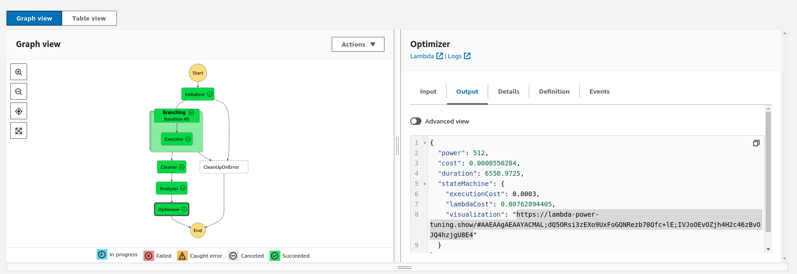
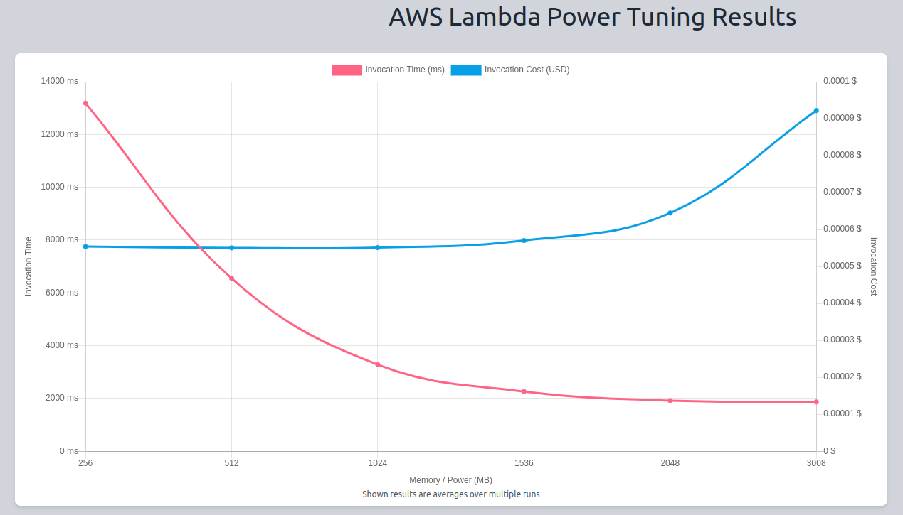

# aws-lambda-power-tuning

Za pomocą narzędzia [aws-lambda-power-tuning](https://github.com/alexcasalboni/aws-lambda-power-tuning)
możemy dostroić konfigurację pamięci/wydajność CPU lambdy.

Istnieje [parę metod wdrażania tego narzędzia](https://github.com/alexcasalboni/aws-lambda-power-tuning/blob/a0f7ae59801030dfa9e6ce1dac042b5181c96edf/README-DEPLOY.md) do naszego konta AWS, ale pewnie najprostszym rozwiązaniem jest wykorzystanie AWS Serverless Application Repository.

Wchodzimy na stronę [aplikacji](https://serverlessrepo.aws.amazon.com/applications/arn:aws:serverlessrepo:us-east-1:451282441545:applications~aws-lambda-power-tuning)
i klikamy w przycisk "Deploy". Po chwili stack CloudFormation zostanie utworzony.

Wybierając usługę AWS Lambda i z menu po lewej "Applications" zobaczymy na liście aplikację "serverlessrepo-aws-lambda-power-tuning".

Przechodzimy do usługi "Step Functions" i wybieramy funkcję "powerTuningStateMachine-XXXX".
Na ekranie szczegółów funkcji klikamy w przycisk "Start execution" i jako input podajemy JSON, w którym dostosowujemy przynajmniej klucz "lambdaARN" do wartości ARN naszej testowanej funkcji - w tym przypadku `arn:aws:lambda:eu-central-1:111222333444:function:thumbnails-ThumbnailsFunction-XXXXXXXX`, a także klucz `payload`.
Moja funckja wyzwalana jest przez usługę AWS S3, gdy pojawią się nowe zdjęcia (lub zdjęcie zostanie skasowane), stąd w moim payload mamy przykładowe zdarzenie powiadomienia S3.

```
{
  "lambdaARN": "arn:aws:lambda:eu-central-1:111222333444:function:thumbnails-ThumbnailsFunction-XXXXXXXX",
  "powerValues": [256, 512, 1024, 1536, 2048, 3008],
  "num": 20,
  "payload": {
    "Records": [
      {
        "eventVersion": "2.0",
        "eventSource": "aws:s3",
        "awsRegion": "eu-central-1",
        "eventTime": "1970-01-01T00:00:00.000Z",
        "eventName": "ObjectCreated:Put",
        "userIdentity": {
          "principalId": "EXAMPLE"
        },
        "requestParameters": {
          "sourceIPAddress": "127.0.0.1"
        },
        "responseElements": {
          "x-amz-request-id": "EXAMPLE123456789",
          "x-amz-id-2": "EXAMPLE123/5678abcdefghijklambdaisawesome/mnopqrstuvwxyzABCDEFGH"
        },
        "s3": {
          "s3SchemaVersion": "1.0",
          "configurationId": "testConfigRule",
          "bucket": {
            "name": "test-XXXXXXXXXXXXXXXXXXX",
            "ownerIdentity": {
              "principalId": "EXAMPLE"
            },
            "arn": "arn:aws:s3:::data.linker.shop"
          },
          "object": {
            "key": "XXXXXXX/test/866-2000x3000.jpg",
            "size": 1024,
            "eTag": "0123456789abcdef0123456789abcdef",
            "sequencer": "0A1B2C3D4E5F678901"
          }
        }
      }
    ]
  },
  "parallelInvocation": true,
  "strategy": "cost"
}
```

Po wykonaniu funkcji klikamy na etap "Optimizer" i przechodzimy do zakładki "Output"



W danych wyjściowych otrzymamy adres URL do [wykresu](https://lambda-power-tuning.show/#AAEAAgAEAAYACMAL;dQ5ORsi3zEXo9UxFoGQNRezb70Qfc+lE;IVJoOEvOZjh4H2c46zBvOJQ4hzjgU8E4).



Funkcja generuje miniaturkę i konwertuje zdjęcie to są to zadania obciążające głównie CPU, stąd czas wykonania zadania maleje aż do osiągnięcia wydajności pełnego rdzenia i po osiągnięciu tego poziomu wzrost wydajności jest minimalny.
