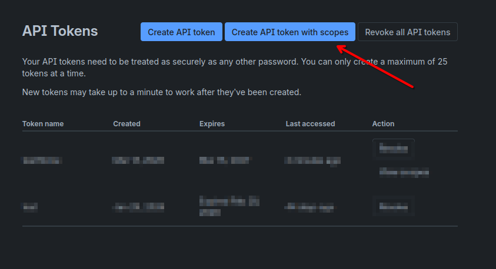
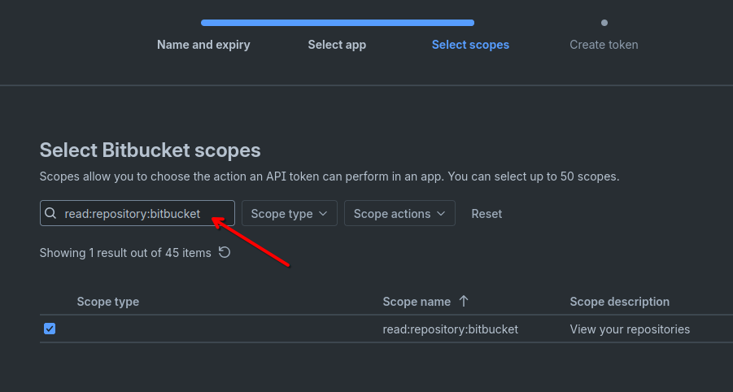

# Bitbucket API tokens

Bitbucket ogłosił, że App Passwords przestaną działać 9 czerwca 2026.
Zamiast nich należy korzystać z API tokens - [Bitbucket Cloud transitions to API tokens: enhancing security with app password deprecation](https://www.atlassian.com/blog/bitbucket/bitbucket-cloud-transitions-to-api-tokens-enhancing-security-with-app-password-deprecation)

Token generujemy na stronie [https://id.atlassian.com/manage-profile/security/api-tokens](https://id.atlassian.com/manage-profile/security/api-tokens).

Klikamy przycisk "Create API token with scopes"



W kroku "Select API token app" wybieramy Bitbucket.

Podczas wyboru zakresu (scope) wpisujemy w wyszukiwarce uprawnienie: `read:repository:bitbucket`.



Zaznaczamy je, klikamy "Next", a następnie na ekranie podsumowania "Create token".

Wygenerowany token zapisujemy w bezpiecznym miejscu.

## Konfiguracja Composera

Wymagana jest wersja Composer 2.8.12+ (dodane wsparcie dla API tokens):

[CHANGELOG 2.8.12](https://github.com/composer/composer/blob/main/CHANGELOG.md#2812-2025-09-19)

[Bitbucket: add support for API tokens](https://github.com/composer/composer/pull/12515)

Tworzymy i eksportujemy zmienną środowiskową `COMPOSER_AUTH`:

```
export COMPOSER_AUTH={"bitbucket-oauth":{"bitbucket.org":{"consumer-key":"twoj-adres-email-konta-bitbucket@example.org","consumer-secret":"UTWORZONY_TOKEN"}}}
```

W moim przypadku przy wywołaniu polecenia: `composer install` pojawiało się okno z pytaniem o login i hasło do Bitbucket.

Można było podać błędne dane logowania, a pakiet i tak został pobrany z Bitbucket.
Wynika to z działania Composera:

[https://github.com/composer/composer/blob/5b236f4fb611083885d18031a9e503e1cdb6a3f6/src/Composer/Util/Git.php#L220](https://github.com/composer/composer/blob/5b236f4fb611083885d18031a9e503e1cdb6a3f6/src/Composer/Util/Git.php#L220)

Po nieudanej próbie pobrania pakietu Composer wywołuje ponownie git clone z odpowiednią autoryzacją.

Aby pozbyć się tego okna, należy ustawić zmienne środowiskowe GIT_TERMINAL_PROMPT oraz GIT_ASKPASS: `GIT_TERMINAL_PROMPT=0 GIT_ASKPASS=0 php ./composer.phar install --no-cache`


composer.json:

```
{
    # .....
    "repositories": [
        {
            "type": "vcs",
            "url": "https://bitbucket.org/foo/bar.git"
        }
    ]
}
```
