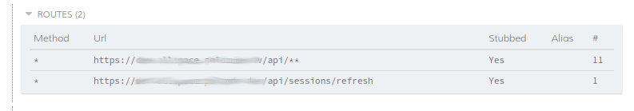

# Cypress

Cypress to biblioteka do przeprowadzenia testów e2e. Od wersji 4.4 zawiera wsparcie dla TypeScript.

## Instalacja i konfiguracja

Najlepiej wydzielić oddzielny katalog dla testów e2e z oddzielnymi zależnościami pakietów.

Instalujemy typescript - `npm install --save-dev typescript`. Następnie tworzymy plik `tsconfig.json` do którego wklejamy zawartość:

```
{
  "compilerOptions": {
    "target": "es5",
    "lib": ["es5", "dom"],
    "types": ["cypress"]
  },
  "include": [
    "**/*.ts"
  ]
}
```

Następnie instalujemy pakiet cypress - `npm install cypress --save-dev`.
Po tych krokach powinniśmy być w stanie otworzyć i zweryfikować czy cypress działa wywołując polecenie - `npx cypress open` i odpalając jeden z przykładowych testów.

Warto dodatkowo zainstalować pakiet `faker` (i pakiet z typami dla TS `@types/faker`). W pliku konfiguracji TypeScript do kluczu `types` należy dodać nowy element `faker`, inaczej TS nie załaduje pliku z definicją dla `faker` - https://www.typescriptlang.org/tsconfig#types. Biblioteka nie wspiera obecnie modułów ES, więc musimy skorzystać z alternatywnej składni `import * as fakerPL from 'faker/locale/pl'`.

W katalogu gdzie instalowaliśmy cypress powinien znajdować się plik konfiguracyjny `cypress.json`. Jeśli go nie ma to go tworzymy i wklejamy minimalną konfigurację:

```
{
  "baseUrl": "http://sut.example.com"
}
```

Aby dodać własny test tworzymy plik `example_spec.ts` w katalogu `cypress/integration`.

[Cypress & TypeScript](https://docs.cypress.io/guides/tooling/typescript-support.html#Install-TypeScript)
[Installing Cypress](https://docs.cypress.io/guides/getting-started/installing-cypress.html)

## Testy parametryzowane

Cypresss dostarcza nam 5 sposobów na [parametryzację testów](https://docs.cypress.io/guides/guides/environment-variables.html). Choć możemy korzystać z pliku `cypress.json` pojawia się problem w zarządzaniu, gdy mamy więcej niż jedno środowisko i potrzebujemy oddzielnej konfiguracji dla każdego środowiska. Najlepszym sposobem jest więc utworzenie pluginu, który załaduje plik konfiguracyjny i scali ją z konfiguracją cypress. W [dokumentacji](https://docs.cypress.io/api/plugins/configuration-api.html#Usage) mamy przykład takiego pluginu.

Musimy tylko dostosować ścieżkę do plików konfiguracyjnego i domyślny plik konfiguracyjny. Następnie możemy odpalić cypress dodając argument `--env` z nazwą pliku konfiguracyjnego - `npx cypress open --env configFile=docker`

```
const fs = require('fs-extra')
const path = require('path')

function getConfigurationByFile(file) {
    const pathToConfigFile = path.resolve('./cypress', 'config', `${file}.json`)
    const raw = fs.readFileSync(pathToConfigFile);

    return JSON.parse(raw);
}

/**
 * @type {Cypress.PluginConfig}
 */
module.exports = (on, config) => {
    // `on` is used to hook into various events Cypress emits
    // `config` is the resolved Cypress config

    // accept a configFile value or use development by default
    const file = config.env.configFile || 'docker';
    const configurationFromFile = getConfigurationByFile(file);

    return { ...configurationFromFile, env: { ...configurationFromFile.env, ...config.env } };
}
```

## Docker i CI

Cypress dostarcza kilka rodzaj [obrazów dockera](https://docs.cypress.io/examples/examples/docker.html#Images) do uruchamiana testów lokalnie czy też w procesie CI. Do uruchamiania testów lokalnie możemy skorzystać z obrazu `cypress/included:<VCYPRESS_VERSION>` - `docker run --rm -it -v $(PWD)/frontend/e2e:/e2e -w /e2e cypress/included:6.2.1 --env configFile=ssorder-develop`. Chcąc zintegrować cypresss z GitLab CI/CD korzystamy z obrazów `cypress/browsers` np. `cypress/browsers:node14.7.0-chrome84`, który zawiera przeglądarkę chrome. Dostępne są także wariant z chromem i firefoxem. Następnie instalujemy cypress i uruchamiamy testy wywołujące polecenie - `npx cypress run --browser chrome --env configFile=ssorder-develop`

[Run Cypress with a single Docker command](https://www.cypress.io/blog/2019/05/02/run-cypress-with-a-single-docker-command/)

W przypadku problemów z działaniem przeglądarki Chrome w Docker możemy spróbować przekazać dodatkowe flagi do chrome - [Add additional flags when running Chrome](https://github.com/cypress-io/cypress/issues/3633)

Przykładowe zadanie dla GitLab CI/CD do uruchomienia testów e2e wykorzystując przeglądarkę chrome wraz z przechowywaniem artefaktów z testów:

```
cypress:
  image: cypress/browsers:node14.7.0-chrome84
  stage: qa
  script:
    - pushd frontend/e2e
    - npm ci
    - $(npm bin)/cypress verify
    - $(npm bin)/cypress run --browser chrome --env configFile=ssorder-develop
  artifacts:
    expire_in: 1 week
    when: always
    paths:
      - frontend/e2e/cypress/
  rules:
    - if: '$CI_PIPELINE_SOURCE == "schedule"'
```

[Cypress tests in Docker on GitLab](https://gitlab.com/cypress-io/cypress-example-docker-gitlab)

## Retries

Polecenia które odpytują drzewo DOM są automatycznie ponawiane aż do przekroczenia parametru limitu czasu (timeout). Dzięki temu nasze testy są bardziej niezawodne. Dodanie do aplikacji asynchronicznego kodu nie powoduje niepowodzenia testów.
Jednak tylko ostatnie polecenie w łańcuchu podlega ponawianiu. [Takie zachowanie może doprowadzić do pewnych błędów.](https://docs.cypress.io/guides/core-concepts/retry-ability.html#Only-the-last-command-is-retried)

[Use should with a callback](https://docs.cypress.io/guides/core-concepts/retry-ability.html#Use-should-with-a-callback)

Testy uruchomione na serwerze ciągłej integracji mogą czasem się nie powieść. Najczęściej jest to spowodowane losowymi problemami z siecią. Cypress może ponownie uruchomić testy zakończone niepowodzeniem, aby zredukować błędy kompilacji CI. W pliku konfiguracyjnym `cypress.json` dodajemy klucz "retries" z opcjami `runMode` i `openMode`.

```
{
  "retries": {
    // Configure retry attempts for `cypress run`
    // Default is 0
    "runMode": 2,
    // Configure retry attempts for `cypress open`
    // Default is 0
    "openMode": 0
  }
}
```

[Test Retries](https://docs.cypress.io/guides/guides/test-retries.html)

## Typy TypeScript

Definiując własne polecenia w cypress i korzystając z TypeScript musimy rozszerzyć interfejs `Chainable` o deklarację naszych poleceń. Musimy utworzyć plik `support/index.d.ts` z zawartością:

```
/// <reference types="cypress" />

declare namespace Cypress {
    interface Chainable {
        /**
         * A command for receiving an access token
         */
        getAuthToken(userName: string, password: string): Chainable<string>;
    }
}

```

[Types for custom commands](https://docs.cypress.io/guides/tooling/typescript-support.html#Types-for-custom-commands)

## Filmy i zrzuty ekranu w wysokiej rozdzielczości

Zrzuty ekranu i film z przebiegu testu są ważną częścią w analizie niepoprawnych testów. W trybie headless testy są odpalane w przeglądarce z rozdzielczością 1000 x 660. Możemy zmienić te ustawienia, ale musimy to zrobić dla każdej przeglądarki oddzielnie. Dodatkowo w pliku konfiguracyjnym ustawiamy dwa parametry: `viewportWidth` i `viewportHeight`. Możemy je także przekazać jako argumenty `--config viewportWidth=1920,viewportHeight=1080`.

W pliku `plugins/index.js` w eksportowanej funkcji (`module.exports`) dodajemy poniższy kod:

```
// let's increase the browser window size when running headlessly
// this will produce higher resolution images and videos
// https://on.cypress.io/browser-launch-api
on('before:browser:launch', (browser = {}, launchOptions) => {
    console.log(
        'launching browser %s is headless? %s',
        browser.name,
        browser.isHeadless,
    )

    // the browser width and height we want to get
    // our screenshots and videos will be of that resolution
    const width = 1920
    const height = 1080

    console.log('setting the browser window size to %d x %d', width, height)

    if (browser.name === 'chrome' && browser.isHeadless) {
        launchOptions.args.push(`--window-size=${width},${height}`)

        // force screen to be non-retina and just use our given resolution
        launchOptions.args.push('--force-device-scale-factor=1')
    }

    if (browser.name === 'electron' && browser.isHeadless) {
        // might not work on CI for some reason
        launchOptions.preferences.width = width
        launchOptions.preferences.height = height
    }

    if (browser.name === 'firefox' && browser.isHeadless) {
        launchOptions.args.push(`--width=${width}`)
        launchOptions.args.push(`--height=${height}`)
    }

    return launchOptions
});
```

[Generate High-Resolution Videos and Screenshots](https://cypress-io.ghost.io/blog/2021/03/01/generate-high-resolution-videos-and-screenshots/)

[DEMO](https://github.com/bahmutov/cypress-wikipedia/tree/abc02b74e12ba3f3c38de5635fef6bf4b2875213)

### Problemy z płynnym nagrywaniem filmów

W przypadku nie wystarczającej wydajności maszyny, na której uruchomiane są testy w wynikowy filmie interfejs Cypress nie będzie się zmieniał przez parę sekund. Ten problem [jest znany](https://github.com/cypress-io/cypress/issues/4722#issuecomment-515562987). Obecnie trwają prace nad [wyświetlaniem ostrzeżenia w przypadku zgubienia/zamrożenia wideo](https://github.com/cypress-io/cypress/issues/5061).

Możemy podczas wywoływania testów ustawić zmienną środowiskową `DEBUG` - `DEBUG=cypress:server:util:process_profiler cypress run .........`. Co 10 sekund na wyjściu pojawią się aktualne statystyki:

```
  cypress:server:util:process_profiler current & mean memory and CPU usage by process group:
  cypress:server:util:process_profiler ┌─────────┬───────────────────┬──────────────┬───────────────────────────────────────────────────────┬────────────┬────────────────┬──────────┬──────────────┬─────────────┐
  cypress:server:util:process_profiler │ (index) │       group       │ processCount │                         pids                          │ cpuPercent │ meanCpuPercent │ memRssMb │ meanMemRssMb │ maxMemRssMb │
  cypress:server:util:process_profiler ├─────────┼───────────────────┼──────────────┼───────────────────────────────────────────────────────┼────────────┼────────────────┼──────────┼──────────────┼─────────────┤
  cypress:server:util:process_profiler │    0    │     'Chrome'      │      8       │ '1333, 1338, 1339, 1341, 1356, 1342 ... 2 more items' │   39.74    │      3.9       │  548.2   │    424.42    │    548.2    │
  cypress:server:util:process_profiler │    1    │     'cypress'     │      1       │                         '257'                         │   15.11    │     29.79      │  154.06  │    179.06    │   231.05    │
  cypress:server:util:process_profiler │    2    │     'plugin'      │      1       │                         '479'                         │    0.53    │      0.16      │  88.36   │    106.5     │   141.87    │
  cypress:server:util:process_profiler │    3    │ 'electron-shared' │      4       │                 '264, 421, 265, 457'                  │     0      │       0        │  70.26   │    131.12    │   177.25    │
  cypress:server:util:process_profiler │    4    │     'ffmpeg'      │      1       │                        '1332'                         │   13.26    │     20.37      │  69.43   │    38.84     │    69.43    │
  cypress:server:util:process_profiler │    5    │      'other'      │      2       │                     '1419, 1420'                      │     0      │       0        │   3.38   │     3.37     │    3.43     │
  cypress:server:util:process_profiler │    6    │      'TOTAL'      │      17      │                          '-'                          │   68.63    │     52.92      │  933.68  │    853.31    │   1079.62   │
  cypress:server:util:process_profiler └─────────┴───────────────────┴──────────────┴───────────────────────────────────────────────────────┴────────────┴────────────────┴──────────┴──────────────┴─────────────┘ +10s
  ```

W pliku konfiguracyjnym, który jest wczytywany możemy także wyłączyć kompresję wideo:

```
{
  "videoCompression": false
}
```

## API i upload pliku (FormData)

Cypress nie umożliwia nam wysyłanie obiektu FormData przez `cy.request` ([Posting formData using cypress doesn't work #1647](https://github.com/cypress-io/cypress/issues/1647)). Musimy skorzystać z XMLHttpRequest.
W pliku `support/commands.ts` dodajemy definicję polecenia `uploadFile`.

```
Cypress.Commands.add('uploadFile', (blob: Blob, fileName: string, jwt: string) => {
    Cypress.log({
        name: 'apiUploadFile',
        displayName: 'API Upload file',
        message: `Upload file"`,
        consoleProps: () => {
            return {
                'file': blob,
            }
        }
    });

    const formData = new FormData();
    formData.set('file', blob, fileName);

    const xhr = new XMLHttpRequest();
    xhr.open("POST", "/api/files/upload");
    xhr.setRequestHeader('Authorization', `Bearer ${jwt}`)

    return new Cypress.Promise((resolve, reject) => {
        xhr.onload = function () {
            resolve(xhr);
        };
        xhr.onerror = function () {
            resolve(xhr);
        };

        xhr.send(formData);
    })
})
```
W pliku `support/index.d.ts` dodajemy deklarację naszej metody dla TS.
```
/// <reference types="cypress" />

declare namespace Cypress {
    interface Chainable {
        uploadFile(blog: Blob, fileName: string, token: string): Chainable<XMLHttpRequest>;
    }
}
```

Następnie tworzymy test. Z fixtures pobieramy plik i korzystając z nowego polecenia cypress `uploadFile` przesyłamy plik na serwer.

```
const fileName = 'huge.jpg';

cy.fixture(fileName, 'binary')
    .then(Cypress.Blob.binaryStringToBlob)
    .then( (blob) => {
        cy.uploadFile(blob, fileName, token).then(response => {
            expect(response.status).to.eq(201);
        });
    });
```

## REST API i cy.intercept

Jeden z projektów został podzielony na dwie część: backend i frontend. Backend potrafił dostosować działanie aplikacji do rynku np. polskiego czy też amerykańskiego. Jednak z powodu braku tej funkcji na front musiałem wykorzystać polecenie `intercept` cypressa.

Poniższy fragment kodu nadpisuje wartość nagłówka `x-sales-channel` tym samym ustawia kontekst działania backendu na rynek polski. W GUI cypress, będziemy widzieć liczbę requestów, które zostały przechwycone przez ten interceptor.



```
cy.intercept('https://domain.example.com/api/**', (req) => {
    req.headers['x-sales-channel'] = 'pl';
});
```

Token JWT i refreshToken nie był przechowywany w localStorage ze względów na bezpieczeństwo. RefreshToken był przechowywany w ciasteczku, które było przesyłane wraz z żądaniem HTTP do serwera. Wymagało to odpowiedniej konfiguracji CORS.
Jednak wywołanie `cy.clearCookies` nie kasuje ciasteczek ze wszystkich domen. Są na to otwarte zgłoszenia: [cy.clearCookies should clear *ALL* cookies of all domains #408](https://github.com/cypress-io/cypress/issues/408) czy też [Cypress doesn't always clean up cookies #781](https://github.com/cypress-io/cypress/issues/781).
W przypadku testów aplikacji frontendowej użytkownik był automatycznie zalogowany podczas wykonywania kolejnych przypadków testowych. Utworzyłem więc kolejny interceptor, który symulował błędną odpowiedzieć z backendu.
Dzięki temu aplikacja frontendowa, gdy próbowała uzyskać nowy token JWT na podstawie refreshTokenu otrzymywała zawsze błąd, więc użytkownik nie był zalogowany.

```
cy.intercept('https://domain.example.com/api/sessions/refresh', {
    statusCode: 401,
    body: {},
});
```

Kolejność wywołań poleceń `intercept` ma znaczenie. Mokowanie odpowiedzi dla końcówki refreshToken definiujemy po modyfikacji nagłówka `X-SalesChannel` żądania HTTP.

## Stripe

Aby wykonać testy E2E bramki płatności Stripe w pliku konfiguracyjnym `config/frontend.json` dodajemy  `"chromeWebSecurity": false,`. Możemy zainstalować także plugin [cypress-plugin-stripe-elements](https://www.npmjs.com/package/cypress-plugin-stripe-elements), który ułatwia wyciąganie elementów z iframe - `cy.fillElementsInput('cardNumber', '4242424242424242');`.

Konfiguracja tego pluginu jest dostępna na stronie projektu. Niestety plugin ten nie zadziała w projekcie, gdzie nie korzystamy z gotowego widgetu Stripe.js. W takim przypadku mamy dostępne znacznie więcej ramek, w których znajdują się poszczególne elementy formularza.
Ten problem da się obejść tworząc pomocniczą funkcję (na bazie tej z pluginu):

```
const getStripeElement = (iframe, selector) => {
    if (Cypress.config('chromeWebSecurity')) {
        throw new Error('To get stripe element `chromeWebSecurity` must be disabled');
    }

    return cy
        .get('iframe')
        .its('0.contentDocument.body').should('not.be.empty')
        .then(cy.wrap)
        .find(selector);
};

// usage
getStripeElement(`input[data-elements-stable-field-name="cardNumber"]`).type('4242424242424242');
getStripeElement(`input[name="cc-csc"]`).type('123', {force: true});
getStripeElement(`input[name="cc-exp-month"]`).type('12', {force: true});
getStripeElement(`input[name="cc-exp-year"]`).type('28', {force: true});
```

Jednak możemy także przekazać w parametrze referencję do elementu iframe. Najlepiej wykorzystać do tego polecenie cypress, ale najprostsza implementacja to:

```
const getStripeElement = (iframe, selector) => {
    if (Cypress.config('chromeWebSecurity')) {
        throw new Error('To get stripe element `chromeWebSecurity` must be disabled');
    }

    return cy
        .wrap(iframe)
        .its('0.contentDocument.body').should('not.be.empty')
        .then(cy.wrap)
        .find(selector);
};
```

[Testing Stripe Integration with Cypress](https://medium.com/swinginc/testing-stripe-integration-with-cypress-3f0d665cfef7)

## CKEDitor

[How to add/type a text in CKeditor (v4) in Cypress Automation?Or any Method to Set The Value for Ckeditor in Cypress Automation?](https://stackoverflow.com/questions/65068660/how-to-add-type-a-text-in-ckeditor-v4-in-cypress-automationor-any-method-to-s)

### Wersja 4
```
const typeToCKEditor = (haystack, content) => {
    cy.window().then(win => {
        // editor instance can start from haystack
        const keys = Object.keys(win.CKEDITOR.instances).filter((key) => key.indexOf(haystack) > 0);
        win.CKEDITOR.instances[keys[0]].setData(content);
    });
};
```

### Wersja 5
```
cy.get('.ck-content')
    .clear()
    .type('Hello CKEditor');
```
