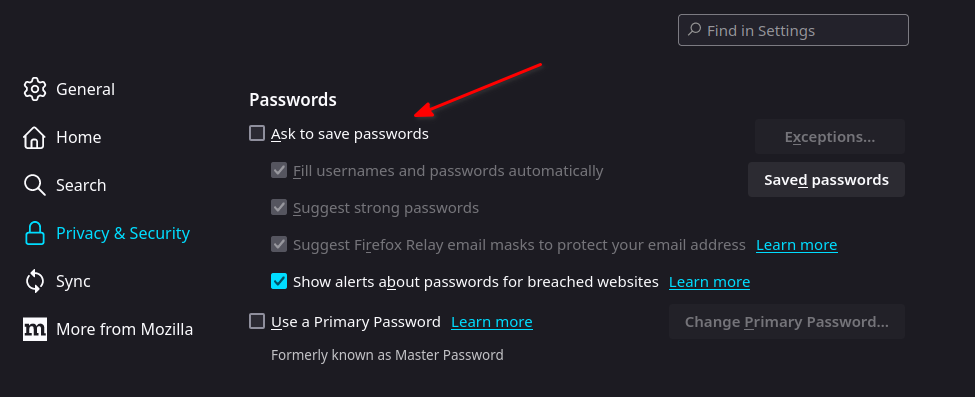

# Firefox

## Wyłączenie WebGL

Wyłączenie WebGL może zwiększyć prywatność podczas przeglądania internetu.

Otwieramy nową kartę w przeglądarce i przechodzimy na adres `about:config`. 
Następnie wyszukujemy parametr `webgl.disabled` i ustawiamy go na wartość `true`.

## Fingerprinting / Poprawa prywatności

Otwieramy nową kartę w przeglądarce i przechodzimy na adres `about:config`.

Następnie szukamy ustawienia `privacy.resistFingerprinting` i przełączamy je na wartość `true`.

Inny rozwiązanie to wykorzystanie rozszerzenia [CanvasBlocker](https://addons.mozilla.org/pl/firefox/addon/canvasblocker/).

Nasze zmiany poprawiające prywatność możemy przetestować na stronie [Am I Unique?](https://amiunique.org/fingerprint).

## Wyłączenie menedżera haseł

Klikamy na "Hamburger menu" i wybieramy opcję "Settings".
Następnie z menu po lewej wybieramy "Privacy and Security".
Przewijamy stronę do sekcji "Passwords" i odznaczamy checkbox "Ask to save passwords".

