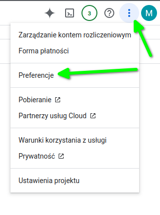

# Google Cloud

## Zmiana języka interfejsu konsoli

Logując się do konsoli Google Cloud, możemy zmienić język interfejsu na angielski.

W prawym górnym rogu, z menu kebab, klikamy pozycję „Preferencje”.



Z menu po lewej stronie wybieramy „Język i region” i zmieniamy wartość pola „Język” na „English”.

[Zmienianie języka konsoli administracyjnej Google](https://support.google.com/cloudidentity/answer/43212?hl=pl)

## OAuth

`gcloud auth print-access-token` - służy do wygenerowania i wyświetlenia tokena
dostępu (OAuth 2), który może być używany do autoryzacji zapytań HTTP do API Google
Cloud w imieniu aktualnie zalogowanego użytkownika lub konta serwisowego.

Google Cloud umożliwia stosowanie dodatkowej warstwy zabezpieczeń poprzez zakresy autoryzacji OAuth 2.
Domyślnie można korzystać z zakresu globalnego, który zapewnia dostęp do wszystkich usług Google Cloud (https://www.googleapis.com/auth/cloud-platform).

Jednak jeśli dana usługa na to pozwala, lepiej ograniczyć dostęp, stosując bardziej precyzyjnie zdefiniowany zakres.
Lista obsługiwanych zakresów dla konkretnej metody API znajduje się w dokumentacji danej usługi Google Cloud.

## Uwierzytelnianie w Google Cloud za pomocą konta serwisowego w PHP

```
<?php

use Google\Auth\Credentials\ServiceAccountCredentials;
use Google\Auth\Middleware\AuthTokenMiddleware;
use GuzzleHttp\Client;
use GuzzleHttp\HandlerStack;

require_once __DIR__ . '/vendor/autoload.php';

$sa = new ServiceAccountCredentials(
    'https://www.googleapis.com/auth/cloud-platform',
    __DIR__ . '/myproject-aabbccc.json'
);
$middleware = new AuthTokenMiddleware($sa);
$stack = HandlerStack::create();
$stack->push($middleware);

$client = new Client([
    'handler' => $stack,
    'base_uri' => 'https://routeoptimization.googleapis.com',
    'auth' => 'google_auth' // authorize all requests
]);

$response = $client->post('/v1/projects/MYPROJECT_ID:optimizeTours', [
    GuzzleHttp\RequestOptions::JSON => [
        # ....
    ]
]);
```

## PHP i uwierzytelnienie z usługą

1. Logujemy się do konsoli Google Cloud i wybieramy (lub tworzymy) nowy projekt.

1. Z menu po lewej wybieramy "Interfejs API i usługi" (ang. APIs & Services) a następnie z podmenu wybieramy "Biblioteka" (ang. Library). Tam wyszukujemy usługę do włączenia np. "Route Optimization API".

1. Tworzymy nową rolę.
W przypadku API "Route Optimization API" możemy skorzystać z wbudowanej roli Google "Route Optimization Editor".
Jendak lepiej stworzyć własną rolę.
Z menu po lewej wybieramy "IAM & Admin", następnie "Roles".
Klikamy w przycisk "Create role".
Klikając "Add permissions" możemy wyszukać gotową rolę "Route Optimization Editor" i dodać jej uprawnienia do naszej nowej roli.

1. Tworzymy konto serwisowe.
Z menu po lewej wybieramy "IAM & Admin", a następnie "Service accounts".
Wypełniamy formularz i przypisujemy rolę utworzoną w poprzednim kroku (lub wbudowaną "Route Optimization Editor").

1. Tworzymy klucz do konta usługowego.
Z menu po lewej wybieramy "IAM & Admin", a następnie "Service accounts".
Przechodzimy do edycji utworzonego konta i zakładki "Keys".
Tworzymy nowy klucz w formacie JSON.

1. Przenosimy pobrany plik w miejsce dostępne dla aplikacji PHP, która będzie pobierać token OAuth2.


Instalujemy pakiet `composer require google/auth`

Aby biblioteka `google/auth` znalazła dane do uwierzytelnienia, plik z poświadczeniami powinien znajdować się pod ścieżką `$HOME/.config/gcloud/application_default_credentials.json`.

Możemy również wskazać lokalizację pliku, ustawiając zmienną środowiskową  `GOOGLE_APPLICATION_CREDENTIALS=/sciezka/do/pliku/json`.

### Przykład kodu PHP

W przykładzie musimy podmienić `NAZWA_PROJEKTU` na identyfikator projektu w Google Cloud.

```
<?php

use Google\Auth\ApplicationDefaultCredentials;
use GuzzleHttp\Client;
use GuzzleHttp\HandlerStack;

require_once __DIR__ . '/vendor/autoload.php';

//putenv('GOOGLE_APPLICATION_CREDENTIALS=' . __DIR__ . '/projectname-aaaabbbcc.json');

$middleware = ApplicationDefaultCredentials::getMiddleware(['https://www.googleapis.com/auth/cloud-platform']);
$stack = HandlerStack::create();
$stack->push($middleware);

$client = new Client([
    'handler' => $stack,
    'base_uri' => 'https://routeoptimization.googleapis.com',
    'auth' => 'google_auth'
]);

$response = $client->post('/v1/projects/NAZWA_PROJEKTU:optimizeTours', [
    GuzzleHttp\RequestOptions::JSON => [
        'model' => [
            'shipments' => [
                [
                    'pickups' => [
                        [
                            'arrivalLocation' => [
                                'latitude' => 37.73881799999999,
                                'longitude' => -122.4161,
                            ],
                        ],
                    ],
                    'deliveries' => [
                        [
                            'arrivalLocation' => [
                                'latitude' => 37.79581,
                                'longitude' => -122.4218856,
                            ],
                        ],
                    ],
                ],
            ],
            'vehicles' => [
                [
                    'startLocation' => [
                        'latitude' => 37.73881799999999,
                        'longitude' => -122.4161,
                    ],
                    'endLocation' => [
                        'latitude' => 37.73881799999999,
                        'longitude' => -122.4161,
                    ],
                ],
            ],
            'globalStartTime' => '2023-01-13T16:00:00-08:00',
            'globalEndTime' => '2023-01-14T16:00:00-08:00',
        ],
    ]
]);


print_r((string)$response->getBody());

```
