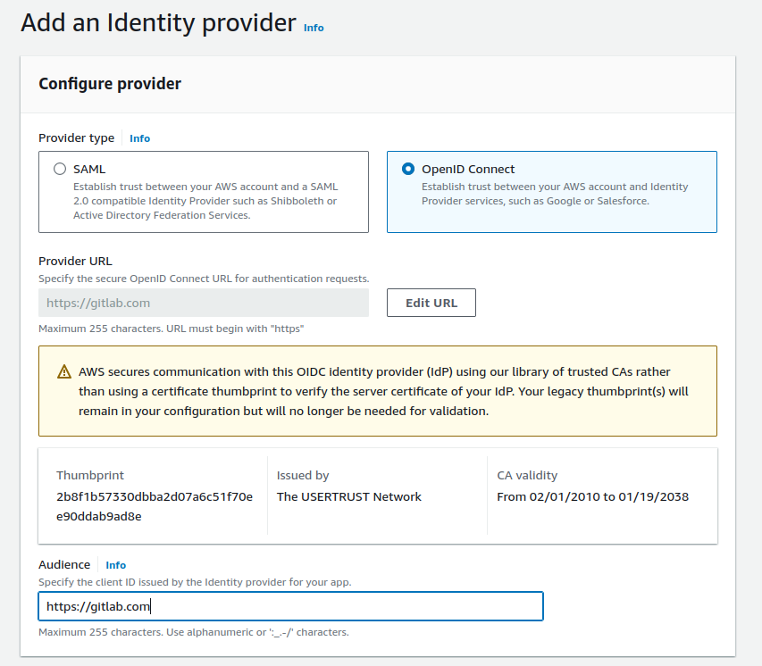
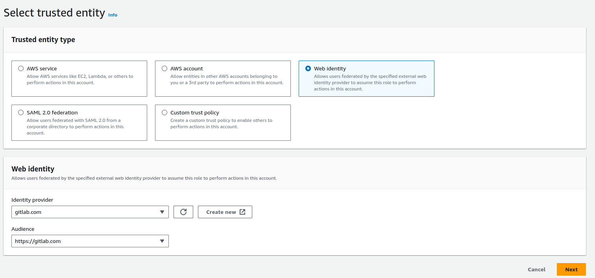

# GitLab, AWS i OpenID Connect

W GitLab CI/CD nie musimy zaszywać w zmiennych środowiskowych tokenów AWS.
Dzięki obsłudze OpenID Connect po stronie GitLab i AWS możemy pobrać z AWS tymczasowe tokeny,
co znacząco zwiększa bezpieczeństwo.

W AWS przechodzimy do usługi IAM i z menu po lewej stronie wybieramy "Identity providers" i dodajemy nowego dostawcę.



W polach Provider i Audience podajemy "https://gitlab.com".
Zapisujemy dane i tworzymy rolę.

W sekcji "Trusted entity type" zaznaczamy "Web identity".
W "Web identity" wybieramy utworzonego dostawcę z poprzedniego kroku.



Możemy zmodyfikować domyślnie wygenerowaną politykę "Trust policy".
W przykładzie poniżej dodajemy warunek, aby naszą tworzoną rolę mógł przyjąć
tylko zadanie z projektu "morawskim/XXXXX" i z brancza "main".
Dostosowujemy ten warunek do swoich potrzeb.
Jeśli chcemy obsługiwać wszystkie brancze to podajemy "*".
Do tworzonej roli dołączamy własną politykę (np. z dostępem do S3).

```
{
    "Version": "2012-10-17",
    "Statement": [
        {
            "Effect": "Allow",
            "Principal": {
                "Federated": "arn:aws:iam::111122223333:oidc-provider/gitlab.com"
            },
            "Action": "sts:AssumeRoleWithWebIdentity",
            "Condition": {
                "StringEquals": {
                    "gitlab.com:aud": "https://gitlab.com"
                },
                "StringLike": {
                    "gitlab.com:sub": "project_path:morawskim/XXXXX:ref_type:branch:ref:main"
                }
            }
        }
    ]
}
```

W pliku `.gitlab-ci.yml` dodajemy nowy job.
"assumerole" wykorzystuje aws cli do pobrania tymczasowych tokenów.
Mając te tokeny możemy je przekazać dalej.

"assumeroleV2" jest mniej skomplikowany.
W tym przypadku konfigurujemy aws cli, aby korzystał z OpenID Connect.

```

assumerole:
  image:
    name: amazon/aws-cli:latest
    entrypoint: [""]
  variables:
    ROLE_ARN: "arn:aws:iam::111122223333:role/gitlabci-test"
    AWS_PROFILE: oidc
  id_tokens:
    GITLAB_OIDC_TOKEN:
      aud: https://gitlab.com
  script:
    - >
      export $(printf "AWS_ACCESS_KEY_ID=%s AWS_SECRET_ACCESS_KEY=%s AWS_SESSION_TOKEN=%s"
      $(aws sts assume-role-with-web-identity
      --role-arn ${ROLE_ARN}
      --role-session-name "GitLabRunner-${CI_PROJECT_ID}-${CI_PIPELINE_ID}"
      --web-identity-token ${GITLAB_OIDC_TOKEN}
      --duration-seconds 3600
      --query 'Credentials.[AccessKeyId,SecretAccessKey,SessionToken]'
      --output text))
    - aws sts get-caller-identity
    - aws s3 ls

assumeroleV2:
  image:
    name: amazon/aws-cli:latest
    entrypoint: [""]
  id_tokens:
    GITLAB_OIDC_TOKEN:
      aud: https://gitlab.com
  variables:
    ROLE_ARN: "arn:aws:iam::111122223333:role/gitlabci-test"
    AWS_PROFILE: oidc
  script:
    - mkdir -p ~/.aws
    - echo "${GITLAB_OIDC_TOKEN}" > /tmp/web_identity_token
    - echo -e "[profile oidc]\nrole_arn=${ROLE_ARN}\nweb_identity_token_file=/tmp/web_identity_token" > ~/.aws/config
    - aws sts get-caller-identity
    - aws s3 ls
```

W przypadku otrzymania błędu:

> An error occurred (AccessDenied) when calling the AssumeRoleWithWebIdentity operation:
> Not authorized to perform sts:AssumeRoleWithWebIdentity

najczęściej przyczyną błędu jest warunek "gitlab.com:sub" w Trust Policy.

Token JWT GitLab jest maskowany w logach.
Możemy go wyświetlić kodując go poleceniem base64 - `echo $GITLAB_OIDC_TOKEN | base64`.
Następni kopiujemy otrzymany ciąg znaków, dekodujemy go poleceniem `base64 -d`
i wklejamy na stronie [https://jwt.io/](https://jwt.io/).

Sparsowany token będzie zawierał claim "sub".
Ta wartość powinna zgadzać się z wartością "gitlab.com:sub" w Trust Policy (jeśli nie korzystamy z "*").


[Configure OpenID Connect in AWS to retrieve temporary credentials](https://docs.gitlab.com/ee/ci/cloud_services/aws/)
