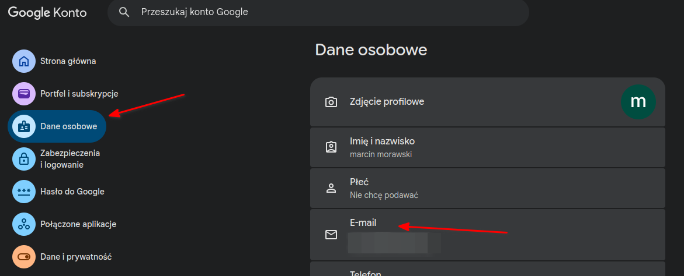
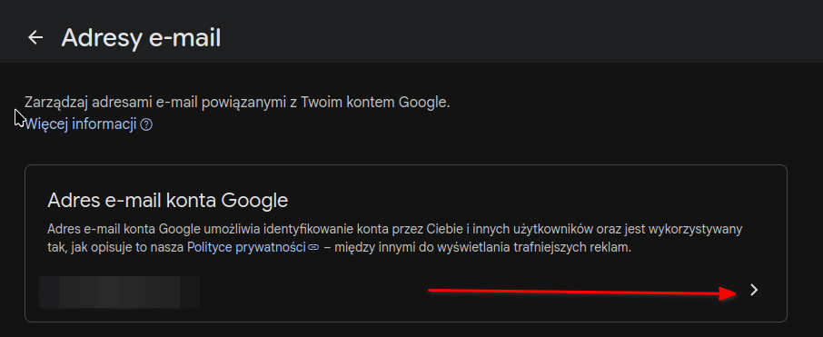
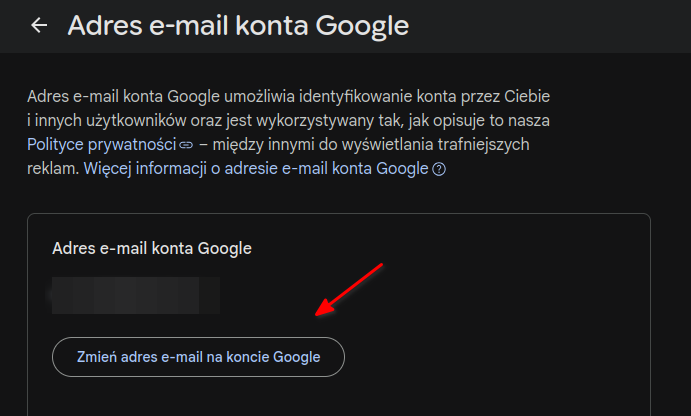

# Gmail - zmiana adresu email

Funkcja ta jest wdrażana stopniowo, dlatego nie każdy użytkownik zobaczy ją.

Wejdź na stronę ustawień konta Google i przejdź do [Dane osobowe](https://myaccount.google.com/personal-info).

Otwórz sekcję E-mail i wybierz E-mail konta Google.

Jeśli masz taką możliwość, zobaczysz opcję [Zmień adres e-mail konta Google](https://myaccount.google.com/google-account-email).

[Change your Google Account email](https://support.google.com/accounts/answer/19870)

