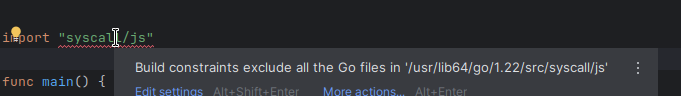
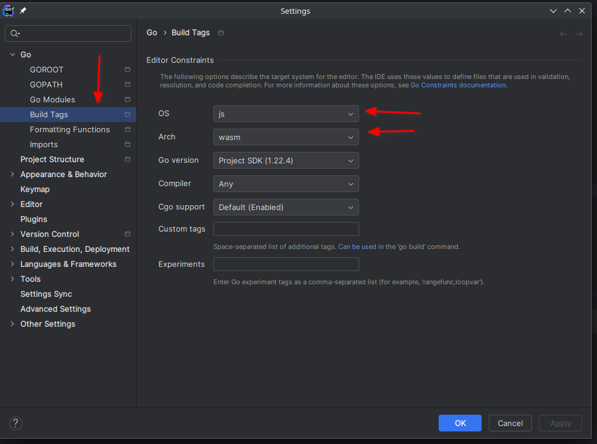

# Golang i WebAssembly

[Przykład](https://github.com/morawskim/go-projects/tree/main/webassembly)

## Konfiguracja GoLand dla WebAssembly

Tworząc projekt WebAssembly w GoLand przy imporcie pakietu `syscall/js` możemy otrzymać błąd:

W takim przypadku musimy w konfiguracji projektu `File -> Settings -> Go -> Build Tags` wybrać "js" dla "OS" o "wasm" dla Arch.

[Configuring GoLand for WebAssembly (Wasm)](https://go.dev/wiki/Configuring-GoLand-for-WebAssembly)
