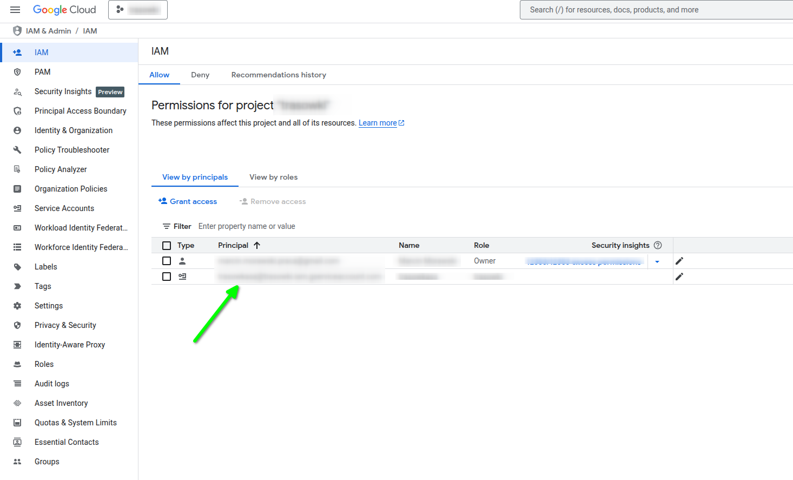
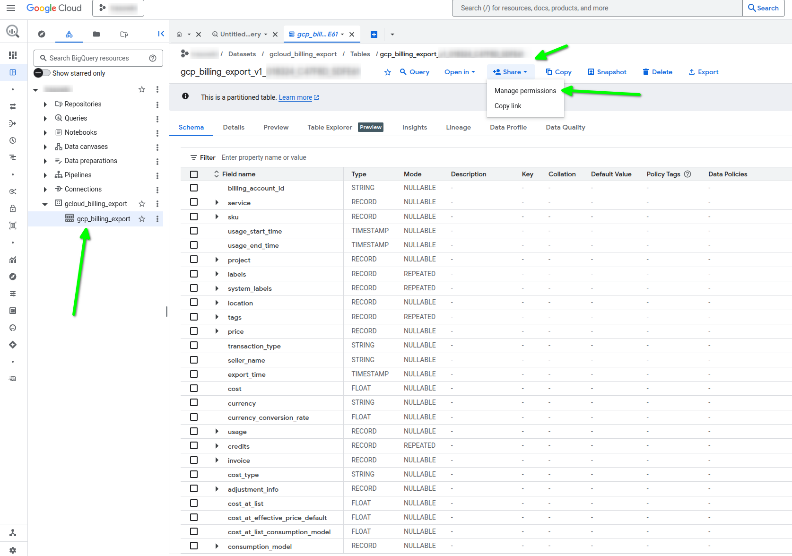
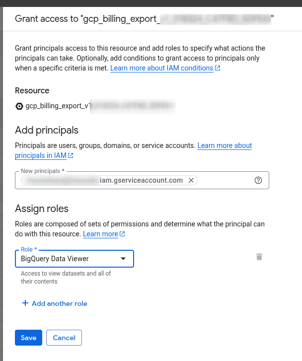
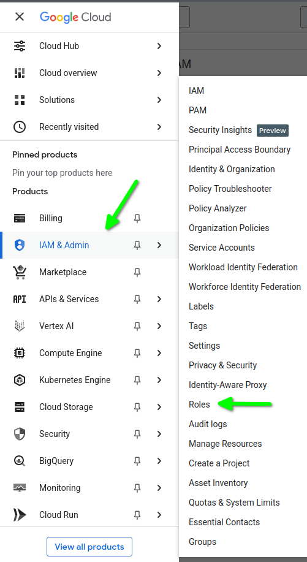
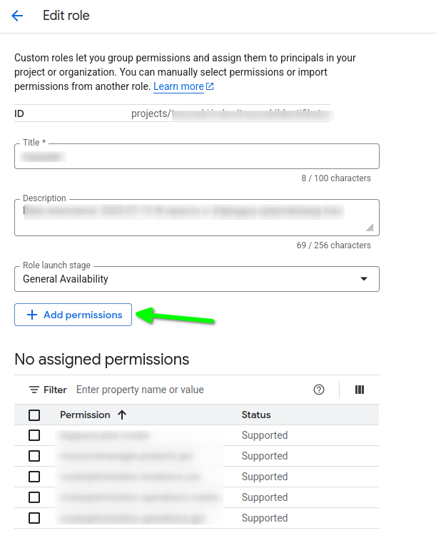
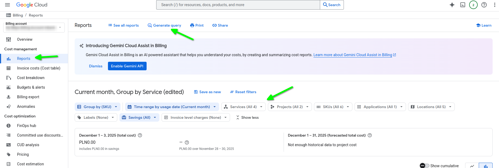

# Google Cloud Billing

W ramach projektu chcieliśmy monitorować koszty w Google Cloud.
Dane te są dostępne w Google Cloud Billing, jednak obecnie wygląda na to, że [Google nie oferuje żadnego API umożliwiającego pobranie tych danych bezpośrednio.](https://stackoverflow.com/questions/52470160/api-for-getting-daily-billing-cost-in-gcp#comment91916396_52481857)

Jedynym rozwiązaniem jest [wyeksportowanie danych billingowych do BigQuery i pobieranie ich za pomocą BigQuery API.](https://discuss.google.dev/t/are-there-any-apis-to-get-billing-costs/243842?utm_source=chatgpt.com)

Aby włączyć eksport:

1. Logujemy się do konsoli Google Cloud.
1. Wybieramy projekt, a z menu po lewej stronie przechodzimy do Billing.
1. Będąc na stronie Billing, ponownie z menu po lewej wybieramy Billing Export:

1. Włączamy eksport danych do BigQuery.

[Exporting Your Google Cloud Billing Data to BigQuery](https://medium.com/google-cloud/exporting-your-google-cloud-billing-data-to-bigquery-296cae9a07f2)


Jeśli chcemy pobrać dane billingowe z BigQuery, musimy przypisać odpowiednie uprawnienia np. kontu serwisowemu (ang. service account).

1. Przechodzimy do usługi IAM i kopiujemy adres e-mail konta, z którego będziemy łączyć się z API.

1. Przechodzimy do usługi BigQuery i z menu po lewej wybieramy "Studio". Następnie wybieramy nasz dataset i tabelę. Z paska narzędziowego wybieramy "Share" -> "Manage permissions".

1. Otworzy się okno "Grant access to gcp_billing_export_XXXXX". W polu "New pricipals" wklejamy skopiowany adres email naszego konta usługi i przypisujemy rolę "BigQuery Data Viewer".

1. Konto musi także posiadać uprawnienie `bigquery.jobs.create`. Możemy je nadać poprzez przypisanie odpowiedniej roli. Jeśli konto ma już przypisaną rolę, klikamy ikonę hamburgera i wybieramy kolejno IAM & Admin -> Roles.

1. Na liście ról klikamy w trzy kropki przy naszej roli i wybieramy Edit.

1. W edycji roli dodajemy uprawnienie `bigquery.jobs.create`, klikając przycisk "Add permissions".


## BigQuery zapytanie

1. Z menu po lewej stronie przechodzimy do "Billing". Jeśli mamy wiele konto rozliczeniowych, wybieramy opcję "Go to linked billing account".
1. Na stronie rozliczeń, ponownie wyświetlamy menu i klikamy "Reports" w sekcji "Cost management".

1. Ustawiamy fitry i z paska narzędzi wybieramy "Generate query". (jak na screenie powyżej).
1. Otworzy się nowe okno z gotowym zapytaniem, służącym do wygenerowania raportu.
1. Kopiujemy te zapytanie.
1. Instalujemy pakiet PHP `google/cloud-bigquery`
1. Tworzymy klienta BigQuery:
```
new \Google\Cloud\BigQuery\BigQueryClient([
    'keyFilePath' => getenv('HOME') . '/.config/gcloud/application_default_credentials.json',
])
```
1. Tworzymy metodę `getQuery`, która zwróci skopiowane zapytanie z Google. W zapytaniu dynamicznie podstawiamy datę początkową i datę końcową okresu rozliczeniowego.
1. Wykonujemy zapytanie BigQuery:
```
$queryJobConfig = $this->client->query($this->getQuery($filters));
$queryResults = $this->client->runQuery($queryJobConfig);

foreach ($queryResults as $row) {
// $row zawiera dane pojedynczego wiersza rozlcizenia
}
```

[Generate and run a SQL query against your exported billing data](https://cloud.google.com/billing/docs/how-to/reports#generate-query)
