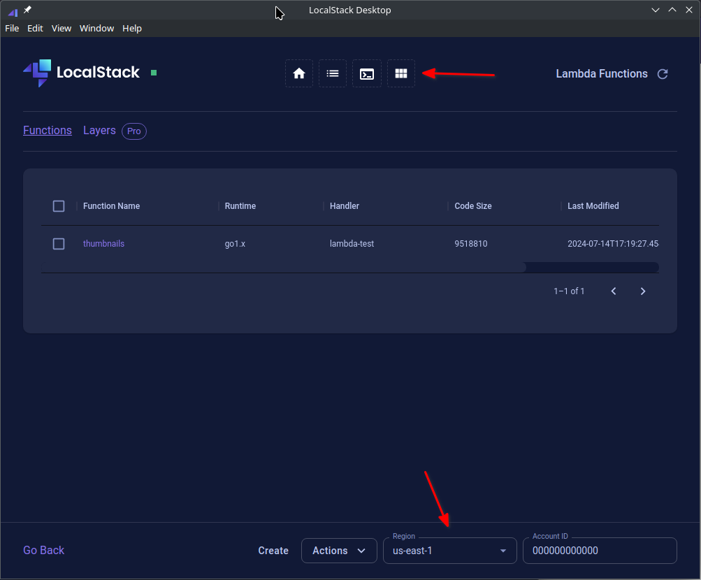

# localstack

## Konfiguracja

Do pliku `docker-compose.yml` dodajemy usługę localstack:

```
services:
  # ....
  localstack:
    image: localstack/localstack:3.5
    ports:
      - "127.0.0.1:4566:4566"            # LocalStack Gateway
      - "127.0.0.1:4510-4559:4510-4559"  # external services port range
    environment:
      # LocalStack configuration: https://docs.localstack.cloud/references/configuration/
      - DEBUG=${DEBUG:-0}
    volumes:
      - "${LOCALSTACK_VOLUME_DIR:-./volume}:/var/lib/localstack"
      - "/var/run/docker.sock:/var/run/docker.sock"
```

Konfigurujemy narzędzie aws-cli ([niezbędna jest wersja >=2.13](https://github.com/aws/aws-cli/issues/1270#issuecomment-1626070761)).
Do pliku "~/.aws/config" dodajemy nowy profil "localstack":
```
[profile localstack]
endpoint_url=http://localhost:4566/
region=us-east-1
output=json
```

Zamiast korzystać z "localhost" możemy podać także wartość "localhost.localstack.cloud".
Następnie w pliku "~/.aws/credentials" konfiguruje access key i secret access key.

```
[localstack]
aws_access_key_id=test
aws_secret_access_key=test
```

Możemy teraz wywoływać polecenia AWS z wykorzystaniem profilu localstack - `aws s3 ls --profile localstack`

## Terraform

Localstack bardzo łatwo integruje się z Terraform/Opentofu jeśli skonfigurowaliśmy dedykowany profil dla aws-cli.
W pliku `main.tf` dodajemy provider AWS i konfigurujemy go, aby korzystał z profilu "localstack".

Dodatkowo ustawiamy opcję `s3_use_path_style` na wartość "true".
Dla zasobów związanych z S3 otrzymalibyśmy błąd z połączeniem do API S3, ponieważ hostname będzie zawierał nazwę bucketa - [Path-Style and Virtual Hosted-Style Requests](https://docs.localstack.cloud/user-guide/aws/s3/#path-style-and-virtual-hosted-style-requests)

```
terraform {
  required_providers {
    aws = {
      source  = "hashicorp/aws"
      version = "5.58.0"
    }
  }
}

provider "aws" {
  region  = "us-east-1"
  profile = "localstack"

  s3_use_path_style = true
}
```

## LocalStack Desktop

Za pomocą aplikacji "LocalStack Desktop" możemy przeglądać utworzone zasoby chmury AWS np. S3 buckets, funkcje lambda itp.
Pobieramy aplikację ze [strony (musimy mieć konto)](https://app.localstack.cloud/download) i ją instalujemy.

Uruchamiamy aplikację i przechodzimy do "Resource Browser" (ostatnia ikona).
Upewniamy się, czy mamy wybrany poprawny region (na dole).



[Dokumentacja LocalStack Desktop](https://docs.localstack.cloud/user-guide/tools/localstack-desktop/)
