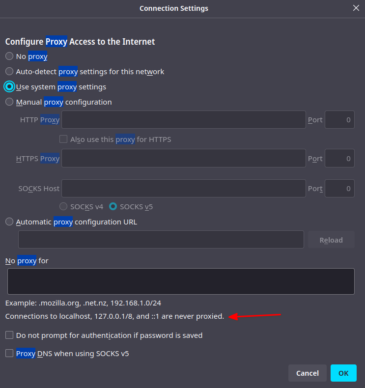

# mitmproxy


## Transparent proxy

Serwer
```
sudo iptables -I FORWARD 1 -o wlan0 -s 192.168.0.0/24 -j ACCEPT
sudo iptables -I FORWARD 2 -i wlan0 -s 192.168.0.0/24 -j ACCEPT
sudo iptables -I INPUT -s 192.168.0.0/24 -p tcp --dport 8080 -j ACCEPT
sudo iptables -t nat -I PREROUTING -p tcp --dport 80 -j REDIRECT --to-port 8080
mitmproxy  -T --host
```

Klient linux

```
sudo route add default gw <IP_SERWERA> eth1
```

## mitmweb - Client connection killed by block_global option

Po migracji klastra kubernetes z IPv4 na IPv6 pojawił się błąd w logach mitmweb: "Client connection from xxxx:xxxx:xxx:xxxx:xxxx::x killed by block_global option.".
Adresy IPv6 są publiczne, więc musimy dodać do polecenia mitmweb parametr `--set block_global=false`.

[Mitmproxy Client connection killed by block_global](https://stackoverflow.com/questions/52068746/mitmproxy-client-connection-killed-by-block-global)

## Reverse proxy

W przeglądarce internetowej możemy skonfigurować serwer proxy przez który będzie przesyłany ruch, ale Firefox domyślnie nie zezwala na przepuszczenie ruchu "localhost" przez serwer proxy.



Możemy zmienić te zachowanie wchodząc na stronę `about:config`, następnie szukamy ustawienia `network.proxy.allow_hijacking_localhost` i zmieniamy wartość na "true".

Lepszym rozwiązaniem jest uruchomienie mitmproxy/mitmweb w trybie "reverse proxy".
Do polecenia uruchamiającego serwer proxy dodajemy `--mode reverse:http://localhost:4200/ -p 8080  --set keep_host_header=true`.

Przechodząc w przeglądarce na adres "localhost:8080" będzie wczytywana strona "localhost:4200", a w mitmproxy/mitmweb będziemy widzieć ruch.

## Przeglądarki i proxy dla localhost

W przeglądarce Firefox i Chrome konfigurując ustawienia proxy, ruch na "localhost" nie jest przekazywany przez skonfigurowany serwer proxy.
W Chrome możemy wykorzystać flagę `--proxy-bypass-list="<-loopback>"` przy uruchamianiu przeglądarki - [Overriding the implicit bypass rules](https://chromium.googlesource.com/chromium/src/+/master/net/docs/proxy.md#overriding-the-implicit-bypass-rules).
W Firefox wpisujemy w pasu adresu `about:config`, następnie szukamy ustawienia `network.proxy.allow_hijacking_localhost` i zmieniamy wartość na "true" - [How to configure Burp Suite for localhost application](https://security.stackexchange.com/questions/142552/how-to-configure-burp-suite-for-localhost-application).
