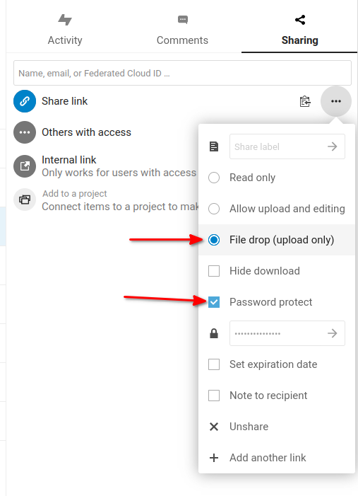

# Nextcloud

## Automatyczne kasowanie starych wersji plików

Modyfikując plik i synchronizując go z chmurą, Nextcloud tworzy nową wersję pliku. Przechowywanie wielu wersji pliku po długim okresie czasu może zajmować sporo miejsca.
Możemy skonfigurować Nextcloud, aby kasował przestarzałe wersje po X dniach.

Tworzymy nowy plik konfiguracyjny `MOJA_NAZWA.config.php` w katalogu `config` o zawartości:
```php
<?php
$CONFIG = [
    'versions_retention_obligation' => 'auto, 5',
];
```

Korzystając z konfiguracji jak powyżej pliki będą automatycznie kasowane po okresie 5 dni.
Możemy ręcznie wywołać proces kasowania plików wywołując polecenie `./occ versions:expire`

[Controlling file versions and aging](https://docs.nextcloud.com/server/27/admin_manual/configuration_files/file_versioning.html)

## curl przesyłanie pliku

W Nextcloud możemy włączyć funkcję "File drop", która pozwala zewnętrznym użytkownikom przesyłanie plików do wybranego katalogu.



Wykorzystując narzędzie curl możemy przesłać plik do chmury - `/usr/bin/curl --progress-bar -T "./test" -u "SHARE_ID:PASSWORD" -H "X-Requested-With: XMLHttpRequest" "https://nextcloud.example.com/public.php/webdav/test"`

Gdzie `SHARE_ID` to identyfikator z wygenerowanego linku np. dla linku "https://nextcloud.com.pl/index.php/s/zxcvbnasdfgqwer" SHARE_ID to "zxcvbnasdfgqwer".

W przypadku gdy zaznaczyliśmy dodatkowo ochronę hasłem to w `PASSWORD` podajemy wygenerowane hasło.

Przy takich  ustawieniach jeśli plik o nazwie `test` istnieje, Nextcloud zapisze plik pod inną nazwą.

Wybierając opcję "Allow upload and editing" nadpiszemy plik o tej samej nazwie podczas przesyłania pliku.

Polecenie curl wyciągnąłem ze skryptu [cloudsend.sh](https://github.com/tavinus/cloudsend.sh)
