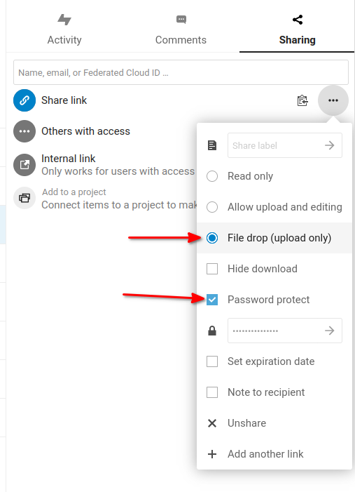
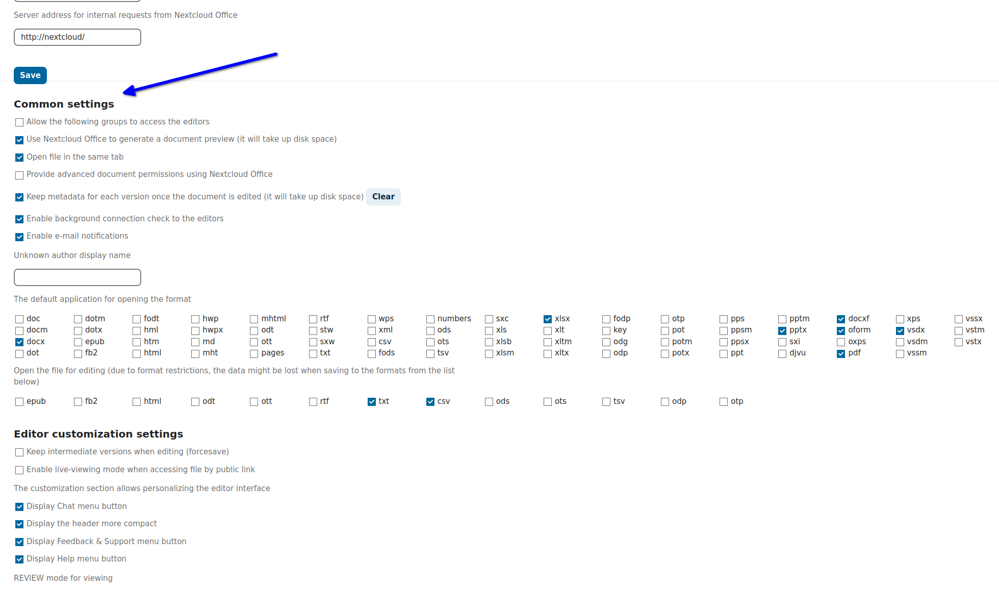

# Nextcloud

## Automatyczne kasowanie starych wersji plików

Modyfikując plik i synchronizując go z chmurą, Nextcloud tworzy nową wersję pliku. Przechowywanie wielu wersji pliku po długim okresie czasu może zajmować sporo miejsca.
Możemy skonfigurować Nextcloud, aby kasował przestarzałe wersje po X dniach.

Tworzymy nowy plik konfiguracyjny `MOJA_NAZWA.config.php` w katalogu `config` o zawartości:
```php
<?php
$CONFIG = [
    'versions_retention_obligation' => 'auto, 5',
];
```

Korzystając z konfiguracji jak powyżej pliki będą automatycznie kasowane po okresie 5 dni.
Możemy ręcznie wywołać proces kasowania plików wywołując polecenie `./occ versions:expire`

[Controlling file versions and aging](https://docs.nextcloud.com/server/27/admin_manual/configuration_files/file_versioning.html)

## curl przesyłanie pliku

W Nextcloud możemy włączyć funkcję "File drop", która pozwala zewnętrznym użytkownikom przesyłanie plików do wybranego katalogu.



Wykorzystując narzędzie curl możemy przesłać plik do chmury - `/usr/bin/curl --progress-bar -T "./test" -u "SHARE_ID:PASSWORD" -H "X-Requested-With: XMLHttpRequest" "https://nextcloud.example.com/public.php/webdav/test"`

Gdzie `SHARE_ID` to identyfikator z wygenerowanego linku np. dla linku "https://nextcloud.com.pl/index.php/s/zxcvbnasdfgqwer" SHARE_ID to "zxcvbnasdfgqwer".

W przypadku gdy zaznaczyliśmy dodatkowo ochronę hasłem to w `PASSWORD` podajemy wygenerowane hasło.

Przy takich  ustawieniach jeśli plik o nazwie `test` istnieje, Nextcloud zapisze plik pod inną nazwą.

Wybierając opcję "Allow upload and editing" nadpiszemy plik o tej samej nazwie podczas przesyłania pliku.

Polecenie curl wyciągnąłem ze skryptu [cloudsend.sh](https://github.com/tavinus/cloudsend.sh)

## Integracja z Euro-Office

W celu rozwiązania problemu integracji Euro-Office z Nextcloud utworzyłem projekt przygotowujący środowisko developerskie Nextcloud.

Wywołujemy polecenie `make setup`, aby pobrać kod źródłowy serwera Nextcloud.

Następnie pobieramy aplikację Euro-Office `make eurooffice`.

Uruchamiamy środowisko `docker compose up -d`.

Po uruchomieniu kontenerów przechodzimy przez standardowy instalator Nextcloud przechodząc na stronę `http:localhost:8080`.

Podajemy:
* nazwę konta administratora,
* hasło,
* dane dostępowe do bazy MySQL.

Po zakończeniu instalacji przechodzimy do `index.php/settings/apps/disabled` i włączamy aplikację "Nextcloud Office".

Następnie przechodzimy do konfiguracji Euro-Office `index.php/settings/admin/eurooffice`.

W polu "Nextcloud Office address" podajemy publiczny adres Euro-Office.
W moim przypadku jest to `127.0.0.1:8081`.

Następnie podajemy token JWT używany podczas konfiguracji serwera Euro-Office.
Token musi mieć co najmniej 32 znaki.

Rozwijamy sekcję "Advanced server settings".

W polu "Nextcloud Office address for internal requests from the server" podajemy wewnętrzny adres Euro-Office `http://eurooffice`.

W polu "Server address for internal requests from Nextcloud Office" podajemy wewnętrzny adres serwera Nextcloud `http://nextcloud`.

Klikamy Save.
Na tym etapie powinniśmy otrzymać błąd:

> Error occurred in the document service: Error while downloading the document file to be converted

Błąd wynika z tego, że Nextcloud nie ufa domenie nextcloud, używanej do komunikacji pomiędzy kontenerami.
Musimy dodać ją do listy zaufanych domen.
Otwieramy plik konfiguracyjny Nextcloud z uprawnieniami administratora `sudo vim server/config/config.php`.
Do klucza `trusted_domains` dodajemy domenę `nextcloud`:

```
//.....
 'trusted_domains' =>
  array (
    0 => 'localhost:8080',
    1 => 'nextcloud',
  ),
```

Po zapisaniu konfiguracji ponownie zapisujemy ustawienia Euro-Office.
Tym razem powinniśmy otrzymać potwierdzenie:

> Server settings have been successfully updated (version 9.3.1.37)

Po pomyślnym zapisaniu ustawień w panelu pojawi się dodatkowa sekcja konfiguracji.



Jednym z elementów integracji jest kontroler `\OCA\Eurooffice\Controller\CallbackController::emptyfile`
Akcja `emptyfile` zwraca pusty dokument i jest wywoływana podczas sprawdzania poprawności integracji z Euro-Office.

[Development environment](https://docs.nextcloud.com/server/latest/developer_manual/getting_started/devenv.html)
