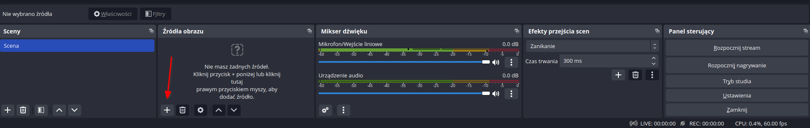
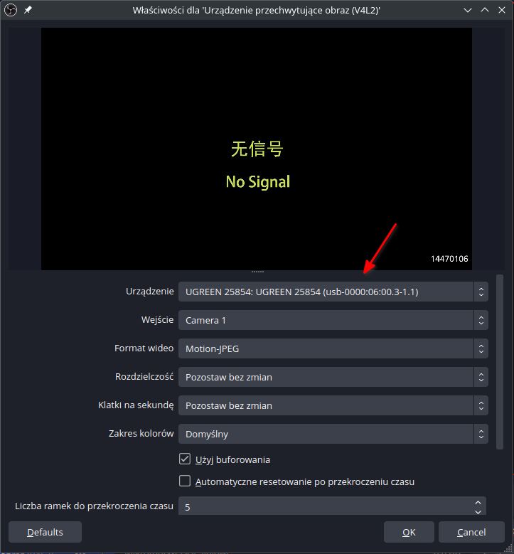
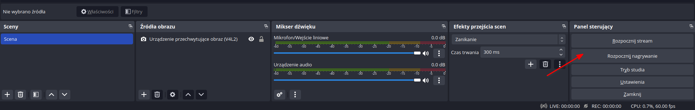

# OBS

[Instalujemy OBS](https://obsproject.com/download) dla swojego systemu.
Uruchamiamy program i w dolnej części ekranu klikamy ikonę "+" w sekcji "Źródła obrazu" i wybieramy opcję "Urządzenie przechwytujące obraz (V4L2)".

Pojawi się nowe okno, w którym wybieramy nasze urządzenie. Dla reszty opcji pozostawiamy domyślne wartości.

Po skonfigurowaniu urządzenia wejściowego klikamy w przycisk "Rozpocznij nagrywanie", który znajduje się w dolnej części programu po prawej stronie (w sekcji "Panel sterujący")

