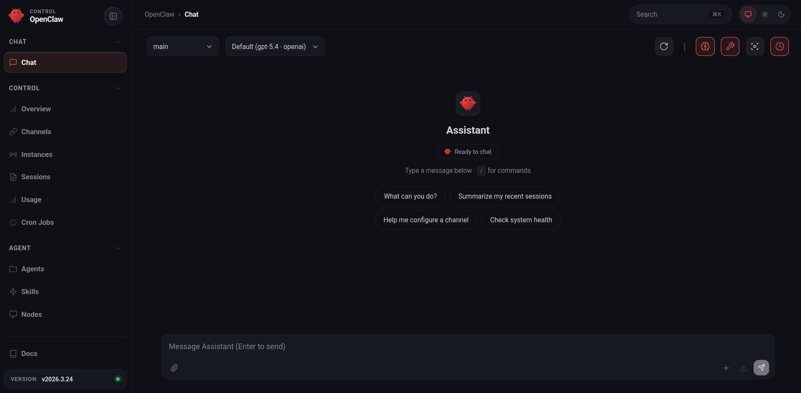

# OpenClaw

Tworzymy plik Dockerfile lub korzystamy z gotowego obrazu:

```
FROM node:25

ENV NODE_ENV=production
RUN npm install -g openclaw mcporter

USER node
CMD ["openclaw", "gateway", "run", "--allow-unconfigured"]
EXPOSE 18789

```

Tworzymy plik docker-compose.yml:

```
services:
  nodejs:
    image: openclaw
    environment:
        - MCPORTER_CONFIG=/home/node/mcporter.json
    env_file: .env
    working_dir: /home/node
    volumes:
         - ./openclaw:/home/node/.openclaw
         - ./mcporter.json:/home/node/mcporter.json
    ports:
      - "18789:18789"

```

Tworzymy plik konfiguracyjny `mcporter.json`.

Zmienna środowiskowa `MCPORTER_CONFIG` powinna wskazywać na ten plik.
Przykładowa konfiguracja (Bitbucket MCP):

```
{
  "mcpServers": {
    "bitbucket": {
        "command": "/usr/local/bin/bitbucket-mcp",
        "args": ["mcp"],
        "transportType": "stdio",
        "disabled": false,
        "timeout": 60
      }
  }
}

```

Startujemy kontenery: `docker compose up -d`

Konfigurujemy OpenClaw: `docker compose exec nodejs openclaw onboard`.
W trakcie konfiguracji kontener może zostać zatrzymany - w takim przypadku należy uruchomić go ponownie i jeszcze raz wykonać powyższe polecenie.

Następnie parujemy przeglądarkę. Wyświetlamy token i adres URL kokpitu: `docker compose exec nodejs openclaw dashboard --no-open`

Otwieramy podany adres URL w przeglądarce i parujemy urządzenie.
Wchodzimy do kontenera `docker compose exec nodejs bash`.
Wyświetlamy oczekujące urządzenia `openclaw devices list`.
Przykład:

```
Pending (1)
┌──────────────────────────────────────┬─
│ Request                              │
├──────────────────────────────────────┼─
│ 21f8d260-e8e9-4257-bb90-e1f19fa60b03 │
```

Akceptujemy żądanie: `openclaw devices approve <Request>`

Po zatwierdzeniu urządzenia powinniśmy zobaczyć panel OpenClaw w przeglądarce.



Podgląd logów OpenClaw: `docker compose exec nodejs openclaw logs --follow`

Aby przetestować integrację MCP, uruchom w kontenerze: `mcporter call bitbucket`.
