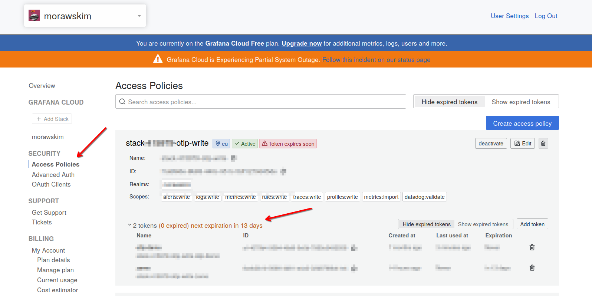
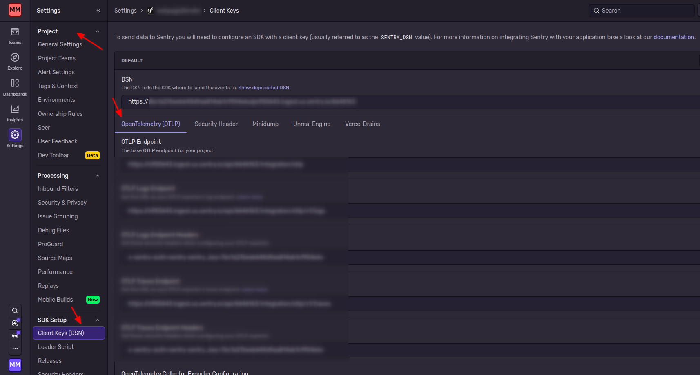

# opentelemetry-collector

## docker-compose jaeger

```
services:
  # ...
  otel-collector:
    image: otel/opentelemetry-collector-contrib
    volumes:
      - ./otel-collector-config.yaml:/etc/otelcol-contrib/config.yaml
    ports:
      - 1888:1888 # pprof extension
      - 8888:8888 # Prometheus metrics exposed by the Collector
      - 8889:8889 # Prometheus exporter metrics
      - 13133:13133 # health_check extension
      - 4317:4317 # OTLP gRPC receiver
      - 4318:4318 # OTLP http receiver
      - 55679:55679 # zpages extension
  jaeger:
    image: cr.jaegertracing.io/jaegertracing/jaeger:2.9.0
    ports:
      - 6831:6831/udp
      - 16686:16686 # Jaeger UI
```

### otel-collector-config.yaml

```
# https://opentelemetry.io/docs/collector/deployment/agent/
receivers:
  otlp: # the OTLP receiver the app is sending traces to
    protocols:
      http:
        endpoint: 0.0.0.0:4318
      grpc:
        endpoint: 0.0.0.0:4317
processors:
  batch:

exporters:
  otlp/jaeger: # Jaeger supports OTLP directly
    endpoint: jaeger:4317
    tls:
      insecure: true

service:
  pipelines:
    traces/dev:
      receivers: [otlp]
      processors: [batch]
      exporters: [otlp/jaeger]

```

## Grafana Cloud

Zakładamy konto w Grafana Cloud. Następnie logujemy się na stronie [https://grafana.com](https://grafana.com).
Wybieramy swoją instancję w menu po lewej ("GRAFNA CLOUD"). Następnie w sekcji zarządzania stosem aplikacji znajdujemy "OpenTelemetry" i klikamy przycisk "Configure". Kopiujemy wartość "OTLP Endpoint", "Instance ID" i generujemy nowy token. Skopiowane wartości powiniśmy zapisać w pliku `.env`.

```
GRAFANA_CLOUD_OTLP_ENDPOINT=https://otlp-gateway-prod-eu-west-0.grafana.net/otlp
GRAFANA_CLOUD_INSTANCE_ID=411111
GRAFANA_CLOUD_TOKEN=glc_xxxxxxxxxxxxxxxxxxxxxxxxxxxxxxxxxxxx
```

```
services:
  otel-collector:
    image: otel/opentelemetry-collector-contrib
    volumes:
      - ./grafana-otel-collector-confing.yml:/etc/otelcol-contrib/config.yaml
    ports:
      - 1888:1888 # pprof extension
      - 8888:8888 # Prometheus metrics exposed by the Collector
      - 8889:8889 # Prometheus exporter metrics
      - 13133:13133 # health_check extension
      - 4317:4317 # OTLP gRPC receiver
      - 4318:4318 # OTLP http receiver
      - 55679:55679 # zpages extension
    environment:
    - GRAFANA_CLOUD_OTLP_ENDPOINT=${GRAFANA_CLOUD_OTLP_ENDPOINT}
    - GRAFANA_CLOUD_INSTANCE_ID=${GRAFANA_CLOUD_INSTANCE_ID}
    - GRAFANA_CLOUD_TOKEN=${GRAFANA_CLOUD_TOKEN}
```

### grafana-otel-collector-confing.yml

```
receivers:
  otlp:
    protocols:
      grpc:
        endpoint: 0.0.0.0:4317
      http:
        endpoint: 0.0.0.0:4318

exporters:
  otlphttp/grafana_cloud:
    endpoint: ${env:GRAFANA_CLOUD_OTLP_ENDPOINT}
    auth:
      authenticator: basicauth/grafana_cloud

extensions:
  basicauth/grafana_cloud:
    client_auth:
      username: ${env:GRAFANA_CLOUD_INSTANCE_ID}
      password: ${env:GRAFANA_CLOUD_TOKEN}

processors:
  batch:

service:
  extensions: [basicauth/grafana_cloud]
  pipelines:
    traces:
      receivers: [otlp]
      processors: [batch]
      exporters: [otlphttp/grafana_cloud]
    metrics:
      receivers: [otlp]
      processors: [batch]
      exporters: [otlphttp/grafana_cloud]
    logs:
      receivers: [otlp]
      processors: [batch]
      exporters: [otlphttp/grafana_cloud]

```

[Integrating Deno and Grafana Cloud: How to observe your JavaScript project with zero added code](https://grafana.com/blog/2025/08/15/integrating-deno-and-grafana-cloud-how-to-observe-your-javascript-project-with-zero-added-code/)

### Lista utworzonych tokenów

Logujemy się na swoje konto w [Grafana Cloud](https://grafana.com).
W menu po lewej stronie, w sekcji "SECURITY" znajduje się link "Access Policies". Klikamy w niego. Powinniśmy zobaczyć widok podobny do poniższego.



Na liście widzimy utworzone tokeny.
Tokeny, które nie są już potrzebne, możemy usunąć.

## Sentry

Logujemy się do Sentry i wybieramy projekt, do którego chcemy przesyłać sygnały OpenTelemetry.
Następnie w menu po lewej stronie najeżdżamy na ikonę koła zębatego i z sekcji "SDK Setup" klikamy "Client Keys".
Kopiujemy adres OTLP Endpoint oraz token autoryzacyjny.
Dane te będą potrzebne do skonfigurowania OpenTelemetry Collectora.

[OpenTelemetry Protocol (OTLP)](https://docs.sentry.io/concepts/otlp/)




```
# ....
exporters:
  otlphttp/sentry:
    endpoint: https://XXXXXX.ingest.us.sentry.io/api/1111111/integration/otlp
    headers:
      x-sentry-auth: "sentry sentry_key=XXXXXAAAAABBBBBDDDDD"
    compression: gzip
    encoding: proto
service:
  pipelines:
    traces/dev:
      # ...
      exporters: [otlphttp/sentry]
```
