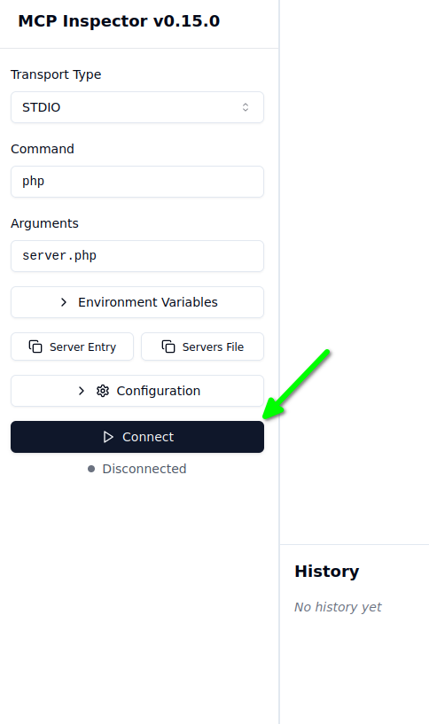
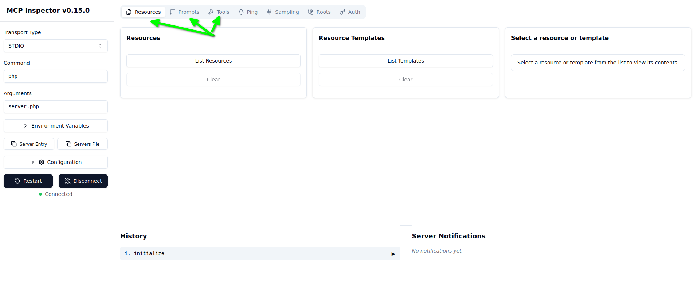
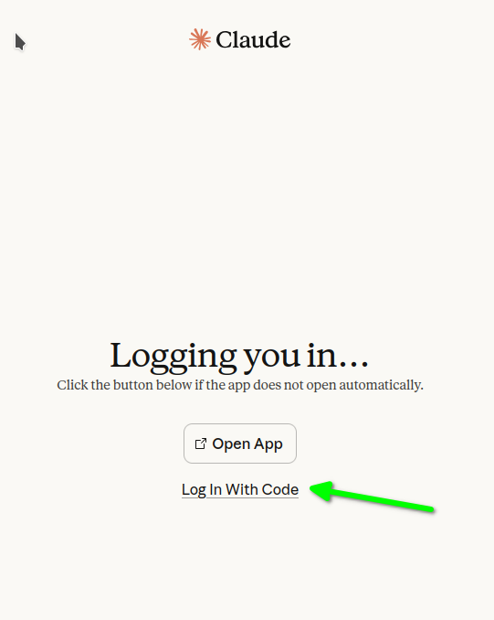
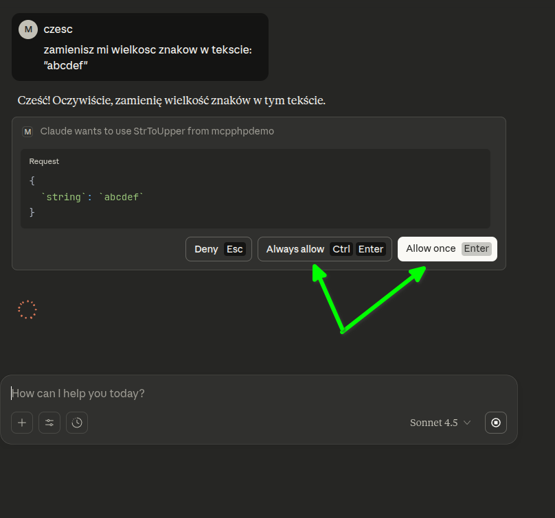
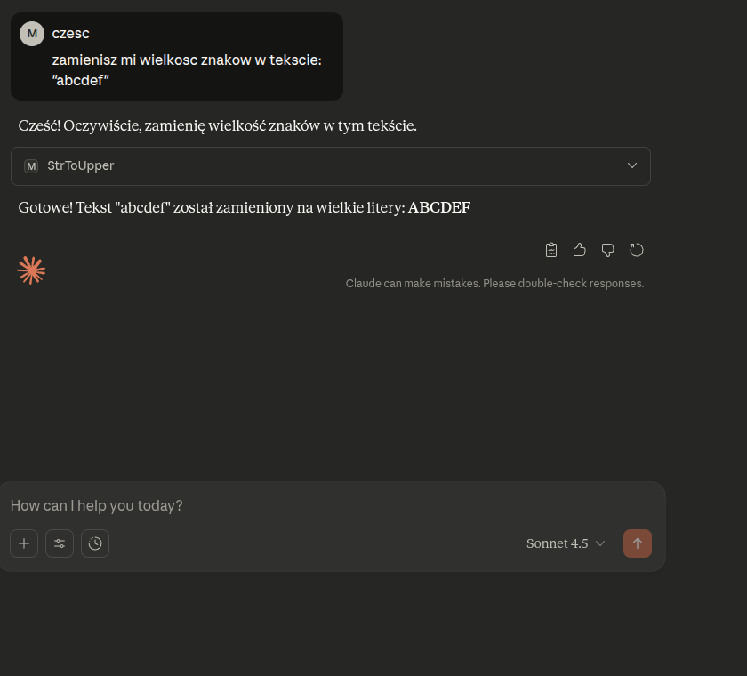

# PHP & MCP (Model Context Protocol)

1. Instalujemy bilibotekę `mcp/sdk` - `composer require mcp/sdk`
1. Korzystając z atrybutów `McpResourceTemplate`, `McpTool` i `McpPrompt` tworzymy funkcję, która będzie dostępna dla LLM.
1. Tworzymy kod serwera korzystając z klasy `Mcp\Server`.

Przykładowy kod prostego [serwera MCP](https://github.com/morawskim/php-examples/tree/master/mcp).

Do testowania naszego serwera MCP możemy skorzystać z narzędzia `modelcontextprotocol/inspector`.
Uruchamiamy polecenie `npx @modelcontextprotocol/inspector php server.php`

Na wyjściu powiniśmy otrzymać adres URL do podłączenia się do insektora.

>Starting MCP inspector...
⚙️ Proxy server listening on 127.0.0.1:6277
🔑 Session token: 7d1ad52c75ce0f0487d1ab99f786625d5b9d328655b8473f19c28db20ba32226
Use this token to authenticate requests or set DANGEROUSLY_OMIT_AUTH=true to disable auth
>
>🔗 Open inspector with token pre-filled:
>http://localhost:6274/?MCP_PROXY_AUTH_TOKEN=7d1ad52c75ce0f0487d1ab99f786625d5b9d328655b8473f19c28db20ba32226
>
>🔍 MCP Inspector is up and running at http://127.0.0.1:6274 🚀
>New STDIO connection request

Otwieramy link w w przeglądarce i łączymy się z naszym serwera MCP.



Następnie możemy już testować nasze zasoby, narzędzia i prompty, wybierając odpowiednią zakładkę z górnego menu w prawym panelu.



## Claude desktop

Obecnie z [oficialnej strony](https://www.claude.com/download) nie możemy pobrać Claude na system Linux.
Istnieje jednak natywana aplikacja na systemy Linux/Debian - [Claude Desktop for Linux](https://github.com/aaddrick/claude-desktop-debian)
W moim przypadku [pobrałem plik AppImage](https://github.com/aaddrick/claude-desktop-debian/releases/tag/v1.1.10%2Bclaude0.14.10).
Pobranemu plikowi nadałem uprawnienie wykonywania - `chmod u+x ./claude-desktop-0.14.10-amd64.AppImage`
Utowrzyłem także plik konfiguracyjny `~/.config/Claude/claude_desktop_config.json` z konfiguracją utworzonego serwera MCP

```
{
    "mcpServers": {
        "mcpphpdemo": {
            "command": "/usr/bin/php",
            "args": [
                "/home/marcin/projekty/php-examples/mcp/server.php"
            ]
        }
    }
}
```

1. Uruchamiamy Claude Desktop.
1. Logujemy się na nasze konto.
1. W mailu od Claude wybieramy opcję logowania przez kod:

1. Podajemy kod w Claude Desktop
1. Tworzymy czat i wpisujemy tekst w stylu: `zamienisz mi wielkosc znakow w tekscie:"abcdef"`

1. Claude odpyta nasz serwer MCP i otrzymamy wynik:

