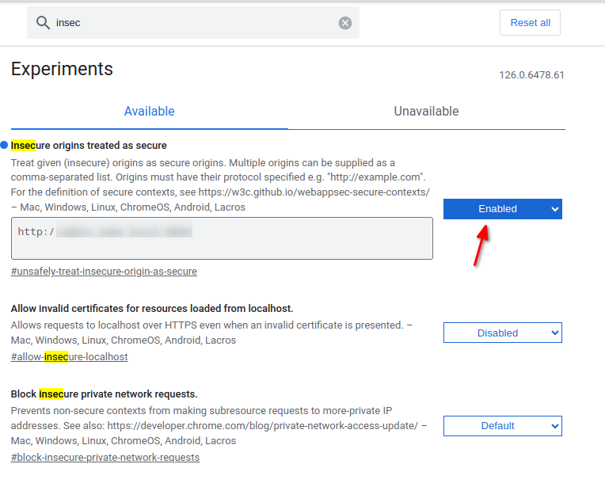

# Przeglądarka i security context

Przeglądarki blokują dostęp do wielu funkcji np. API schowka, jeśli strona nie została załadowana przez protokół HTTPS. 
Generuje to problemy, gdy projekt wykorzystuje wiele domen, a my rozwijamy frontend.

W przypadku przeglądarki Chrome przechodzimy na stronę `chrome://flags/`. 
Następnie szukamy flagi `insecure`.
Lista zostanie zawężona, a my szukamy ustawienia `Insecure origins treated as secure`.
W polu tekstowym wpisujemy nazwę naszej domeny.
Nazwa domeny musi zawierać protokół - `http`.
Obok znajduje się przycisk pozwalający włączyć flagę. Włączamy ją i klikamy w przycisk restartu przeglądarki.

