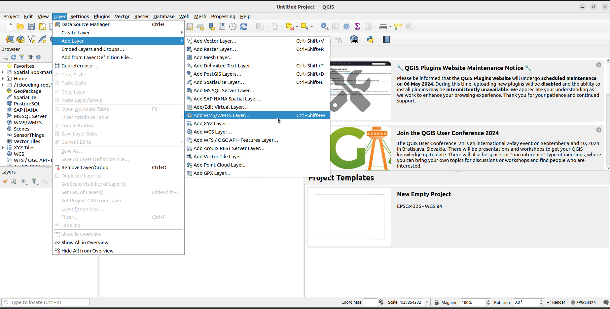

# QGIS

Za pomocą programu qgis możemy utworzyć mapę - [Ekstra mapa topograficzna w kilka minut za darmo? Tutorial krok po kroku.](https://www.youtube.com/watch?v=7WcQnkPZXNk)


W systemie Ubuntu instalujemy niezbędne pakiety - `sudo apt install wget gnupg software-properties-common`.

Następnie pobieramy klucz GPG, który podpisuje pakiety qgis - `sudo wget -O  /etc/apt/keyrings/qgis-archive-keyring.gpg https://download.qgis.org/downloads/qgis-archive-keyring.gpg`.

Dodajemy nowe repozytorium:

```
cat <<EOF | sudo tee /etc/apt/sources.list.d/qgis.sources
Types: deb deb-src
URIs: https://qgis.org/debian
Suites: $(lsb_release -cs)
Architectures: amd64
Components: main
Signed-By: /etc/apt/keyrings/qgis-archive-keyring.gpg
EOF
```

Odświeżamy repozytoria `sudo apt update -y`, a następnie instalujemy qgis `sudo apt install -y qgis qgis-plugin-grass`.

Otwieramy przeglądarkę i wchodzimy na stronę [https://www.geoportal.gov.pl/](https://www.geoportal.gov.pl/).

Z menu "Usługi" wybieramy "Usługi przeglądania WMS i WMTS".
Powinniśmy trafić na stronę [https://www.geoportal.gov.pl/pl/usluga/uslugi-przegladania-wms-i-wmts/](https://www.geoportal.gov.pl/pl/usluga/uslugi-przegladania-wms-i-wmts/)

Przewijamy stronę do sekcji "Mapy topograficzne, ogólnogeograficzne i tematyczne" 
i przy pozycji "Rastrowa Mapa Topograficzna Polski" klikamy w przycisk "Kopiuj adres usługi"


Uruchamiamy qgis.

Ustawiamy układ współrzędnych dla mapy.
Z paska na dole klikamy na standard ESPG.
W otwartym oknie szukamy standardu "2180"
 i go wybieramy.


Dodajmy nową warstwę. Z menu wybieramy "Layer" -> "Add Layer" -> "Add WMS/WMTS Layer" (albo korzystamy ze skrótu `CTRL + SHIFT + W`). Dodatkowo modyfikujemy standard układu współrzędnych na "EPSG:2180".



W oknie powinna pojawić się mapa.


W menu wybieramy "Project" -> "New Print Layout" i podajemy nazwę.


Możemy zmienić rozmiar wydruku klikając prawym przyciskiem myszy na "biały obszar" i z menu wybieramy "Page properties".

Do wydruku dodajemy mapę korzystając z ikonki "add map" z paska po lewej stronie.

Finalnie możemy wyeksportować mapę wybierając z górnego menu "Project" i klikając na jedną z opcji eksportu.
Czekamy na wyeksportowanie mapy, który trochę trwa.


## Google maps

W programie qgis możemy korzystać z map Google.
Klikamy prawym przyciskiem myszy na "XYZ Tiles" i wybieramy opcję "New Connection".


W nowym oknie podajemy dowolną nazwę mapy i jej adres.

Adresy URL map Google są dostępne [tutaj](https://github.com/openlayers/openlayers/issues/9900#issuecomment-527427774)

* Terrain http://mt0.google.com/vt/lyrs=p&hl=en&x={x}&y={y}&z={z}

* Satellite only http://mt0.google.com/vt/lyrs=s&hl=en&x={x}&y={y}&z={z}

* Hybrid http://mt0.google.com/vt/lyrs=y&hl=en&x={x}&y={y}&z={z}

* Terrain only http://mt0.google.com/vt/lyrs=t&hl=en&x={x}&y={y}&z={z}

* Roadmap http://mt0.google.com/vt/lyrs=m&hl=en&x={x}&y={y}&z={z} (mi nic nie wyświetlało)
