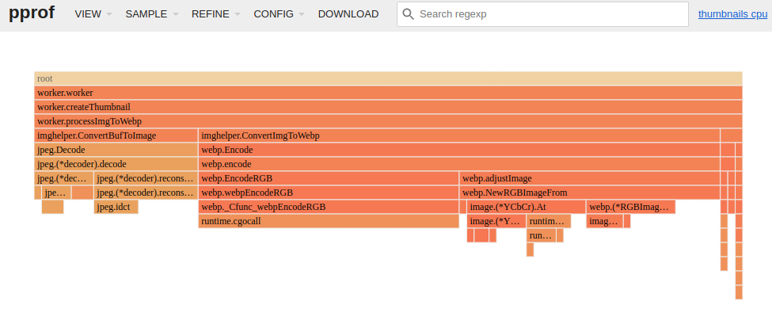

# AWS SAM & Lambda & Go

Wykorzystując AWS SAM zbudowałem funkcję lambda w Go, którą mogłem łatwo wgrać do AWS i ją testować.

Wykorzystywaliśmy istniejące zasoby działające w chmurze AWS dla środowiska produkcyjnego, ale nie korzystaliśmy z Infrastructure as Code.
Szablon z SAM nie był, więc dobrym wyborem. Istnieją jednak inne opcje deploymentu.

Jeśli utworzymy naszą funkcję przez konsole AWS, możemy wgrać nowy kod za pomocą narzędzia AWS CLI.

Musimy skompilować naszą funkcję za pomocą standardowego polecenia `go build`.
Jeśli potrzebujemy (tak jak w tym przypadku biblioteki GLIBC) to możemy wykorzystać poniższy szkic Dockerfile, który instaluje go w Amazon Linux 1.

```
FROM amazonlinux:1

RUN yum install -y wget gcc && \
    wget -qO- https://dl.google.com/go/go1.20.2.linux-amd64.tar.gz | tar -C /usr/local -xz && \
    yum clean all
```

Wykorzystując zbudowany obraz kompilujemy naszą funkcję - `docker run --rm -v go-thumbnails-cache:/root/go -v go-thumbnails-build-cache:/root/.cache/go-build -v $PWD:/app -w /app nazwa-zbudowanego-obrazu-z-Dockerfile go build -o thumbnails ./main.go`. W moiej konfiguracji funkcji, w sekcji Runtime, handler był ustawiony na `thumbnails` dlatego plik wynikowy ma taką nazwę.

Następnie tworzymy archiwum zip z naszym plikiem binarnym: `zip lambda.zip ./thumbnails`.

I finalnie wywołujemy polecenie, które wgra nowy kod.

```
aws lambda update-function-code \
    --function-name thumbnails-ThumbnailsFunction-XXXXXXXXXXXX \
    --region eu-central-1 \
    --zip-file fileb://lambda.zip
```

Jeśli chcemy opublikować nową wersję to do polecenia dodajemy flagę `--publish`.

[Deploy Go Lambda functions with .zip file archives](https://docs.aws.amazon.com/lambda/latest/dg/golang-package.html)


## CPU profiling

Importujemy pakiet `runtime/pprof`.

Następnie w naszej funkcji włączamy profiler CPU

```
f, err := os.Create("/tmp/profiling")
if err != nil {
  panic(fmt.Sprintf("could not create CPU profile: %v", err))
}

defer f.Close() // error handling omitted for example
if err := pprof.StartCPUProfile(f); err != nil {
  panic(fmt.Sprintf("could not start CPU profile: %v", err))
}

// rest of our code
// ..

pprof.StopCPUProfile()
```

Aby dane profilera zostały zapisane na końcu naszej funkcji zatrzymujemy profilowanie CPU.

Budujemy aplikację wywołując polecenie `sam build` i uruchamiamy `sam local start-lambda`. 
Następnie wywołujemy naszą funkcję "ThumbnailsFunction" z payload wczytanym z pliku "events/s3PutExample.json"  - `aws lambda invoke --cli-binary-format raw-in-base64-out --function-name "ThumbnailsFunction" --endpoint-url "http://127.0.0.1:3001" --no-verify-ssl  --payload file://events/s3PutExample.json out.txt`

W tym momencie możemy sprawdzić identyfikator działającego kontenera - `docker ps`. W moim przypadku to `1471d2f8681f`.

```
CONTAINER ID   IMAGE                                     COMMAND                  CREATED         STATUS         PORTS                      NAMES
1471d2f8681f   public.ecr.aws/lambda/go:1-rapid-x86_64   "/var/rapid/aws-lamb…"   4 minutes ago   Up 4 minutes   127.0.0.1:8147->8080/tcp   optimistic_keldysh
```

Mając identyfikator kontenera kopiujemy dane profilera CPU - `docker cp 1471d2f8681f:/tmp/profiling ./profile` i wywołujemy narzędzie go pprof - `go tool pprof -http=:8080 ./profile`.

Uruchomi się strona z danymi profilera. Wybieramy widok "Flame Graph". 
W moim przypadku po wybraniu gorutine odpowiadającej za przetworzenia jednego zdarzenia S3 otrzymałem dane jak poniżej:


