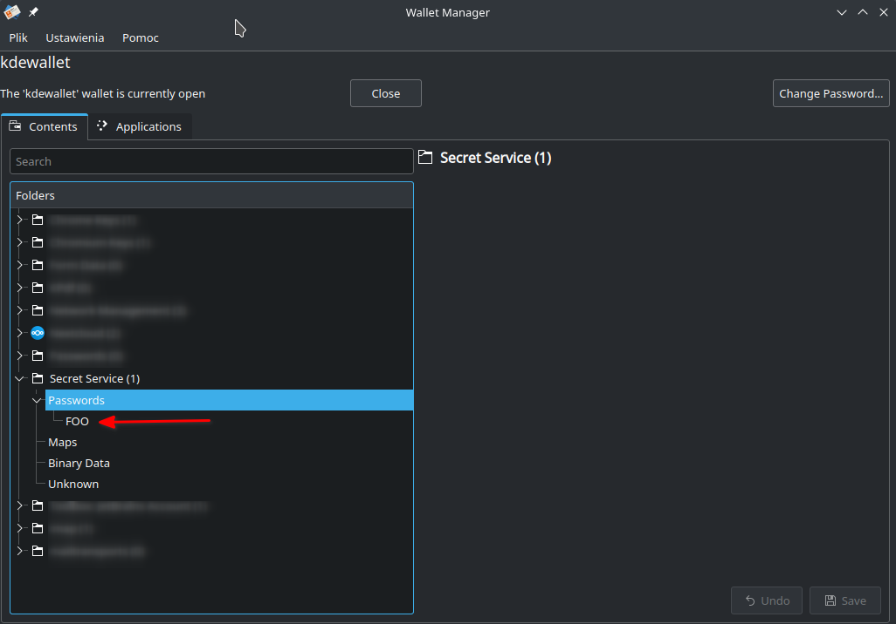

# secret-tool - pobieranie haseł z KWallet w skryptach

Instalując Linuxa z graficznym interfejsem użytkownika mamy dostęp do programów przechowujących hasła, które integrują się z wieloma aplikacjami. W przypadku środowiska KDE jest to KWallet.

Tworząc skrypty uruchamiane z wiersza poleceń możemy wykorzystać "secret-tool" do zapisywania i pobieranie haseł. W dystrybucji openSUSE instalujemy pakiet `secret-tool`.

Za pomocą polecenia `secret-tool store --label=<label> <attribute> <value>` możemy zapisać hasło.
Flaga label jest wymagana i pod taką nazwą będziemy wiedzieć wpis w KWallet.
Argumenty `attribute` i `value` są także wymagane i bardzo ważne, ponieważ hasło będziemy wyciągać podając te dwie wartości. 
Jako attribute możemy podać nazwę aplikacji/usługi, a wartość to nazwa sekretu np. `secret-tool store --label=FOO FOO ACCESS_TOKEN`

Po wpisaniu powyższego polecenia, terminal poprosi o podanie hasła (w tym przypadku tokenu dla usługi FOO).

Następnie możemy pobrać nasz token z KWallet wywołując polecenie `secret-tool lookup FOO ACCESS_TOKEN`. W wyniku otrzymamy naszą zapisaną wartość.
