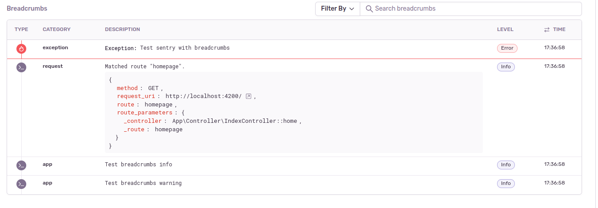

# Sentry

## Symfony

Instalujemy pakiet ` sentry/sentry-symfony` - `composer require sentry/sentry-symfony`.
Jeśli korzystamy z `symfony/flex` to zostanie włączony bundle `SentryBundle`, plik konfiguracyjny `config/packages/sentry.yaml` i zmienna środowiskowa `SENTRY_DSN`.
W przeciwnym przypadku będziemy musieli wykonać te kroki ręcznie.

Wartość `SENTRY_DSN` pobieramy logując się do Sentry. W menu klikamy na "Settings".
Następnie "Projects" i wybieramy nasz projekt.
Z bocznego menu projektu klikamy na `Client Keys (DNS)` i kopiujemy wartość z pola "DSN".

Sprawdzamy z której wersji `symfony/monolog-bundle` korzystamy.

```
composer show | grep monolog
monolog/monolog                            1.26.0                             Sends your logs to files, sockets, inboxes, databases and various web services
symfony/monolog-bridge                     v4.4.20                            Provides integration for Monolog with various Symfony components
symfony/monolog-bundle                     v3.6.0                             Symfony MonologBundle
```

W przypadku wersji poniżej 3.7 do pliku konfiguracyjnego `config/packages/sentry.yaml` dodajemy:

```
monolog:
    handlers:
        sentry:
            type: service
            id: Sentry\Monolog\Handler

services:
    Sentry\Monolog\Handler:
        arguments:
            $hub: '@Sentry\State\HubInterface'
            $level: !php/const Monolog\Logger::ERROR
```

Warto także ustawić klucz `register_error_listener` na wartość `false`, aby nie dublować komunikatów w Sentry - [https://docs.sentry.io/platforms/php/guides/symfony/#monolog-integration](https://docs.sentry.io/platforms/php/guides/symfony/#monolog-integration), [[Sentry Bundle] Clarify config when using monolog #1115](https://github.com/symfony/recipes-contrib/issues/1115).

```
sentry:
    register_error_listener: false
```


Nasza integracja między aplikacją Symfony, a Sentry jest gotowa. Wywołując polecenie ` ./bin/console sentry:test` testowa wiadomość zostanie wysłana do serwera Sentry i zapisana.

[Sentry for Symfony](https://docs.sentry.io/platforms/php/guides/symfony/)

### Performance

Aby monitorować wydajność fragmentu kodu, musimy w pliku konfiguracyjnym `config/packages/sentry.yaml` ustawić opcję
klienta Sentry `traces_sample_rate` na wartość `1.0`. Wtedy każda próbka zostanie przesłana do Sentry.

```
sentry:
    options:
        traces_sample_rate: 1.0
```

W kluczu `options` możemy nadpisać domyślne parametry klienta Sentry. Do klasy `\Sentry\Options` zostaną przekazane wszystkie te ustawienia. Domyślne wartości dostępne są w metodzie `\Sentry\Options::configureOptions`.

Aktualnie istnieje otwarte zgłoszenie [Feature Request: use the symfony route name to group the transactions #547](https://github.com/getsentry/sentry-symfony/issues/547).
[Listener Sentry Symfony](https://github.com/getsentry/sentry-symfony/blob/c016dc2496833c73747a5e5babf04c41791a5118/src/EventListener/TracingRequestListener.php) grupuje próbki po adresie URL np. `/some-resource/specific-resource-identifier-slug` zamiast `/some-resource/{slug}`. Do wyszukiwania próbek musimy skorzystać z tagu `route`.

### Breadcrumb

Od wersji 3.8 SDK dla PHP, Sentry obsługuje [mechanizm breadcrumbs](https://github.com/getsentry/sentry-php/pull/1199).



[Przykładowa konfiguracja](https://github.com/getsentry/sentry-php/pull/1199#issuecomment-1308936577)
Przy takiej konfiguracji w przypadku wystąpienia błędu prócz samego błędu przesłane zostaną dodatkowe wpisy z logu z poziomem min INFO.

```
services:
    Sentry\Monolog\BreadcrumbHandler:
        arguments:
            - '@Sentry\State\HubInterface'
            - !php/const Monolog\Logger::DEBUG

monolog:
    handlers:
        # this one acts like fingers_crossed
        sentry_breadcrumbs:
            type: service
            name: sentry_breadcrumbs
            id: Sentry\Monolog\BreadcrumbHandler
        # this one is the main one, once it captures, the breadcrumbs collected by the first one are submitted too
        sentry:
            type: sentry
            level: !php/const Monolog\Logger::ERROR
            hub_id: Sentry\State\HubInterface
```

### IgnoreErrorsIntegration

W panelu Sentry domyślnie będą także rejestrowane błędy HTTP NotFound 404 czy także 403 AccessDenied.
Możemy je ignorować włączając i konfigurując integrację `IgnoreErrorsIntegration`.

```
sentry:
    options:
        integrations:
            - 'Sentry\Integration\IgnoreErrorsIntegration'

services:
    Sentry\Monolog\Handler:
        arguments:
            $hub: '@Sentry\State\HubInterface'
            $level: !php/const Monolog\Logger::ERROR
    Sentry\Integration\IgnoreErrorsIntegration:
        arguments:
            $options:
                ignore_exceptions:
                    - Symfony\Component\HttpKernel\Exception\NotFoundHttpException
                    - Symfony\Component\Security\Core\Exception\AccessDeniedException
```
