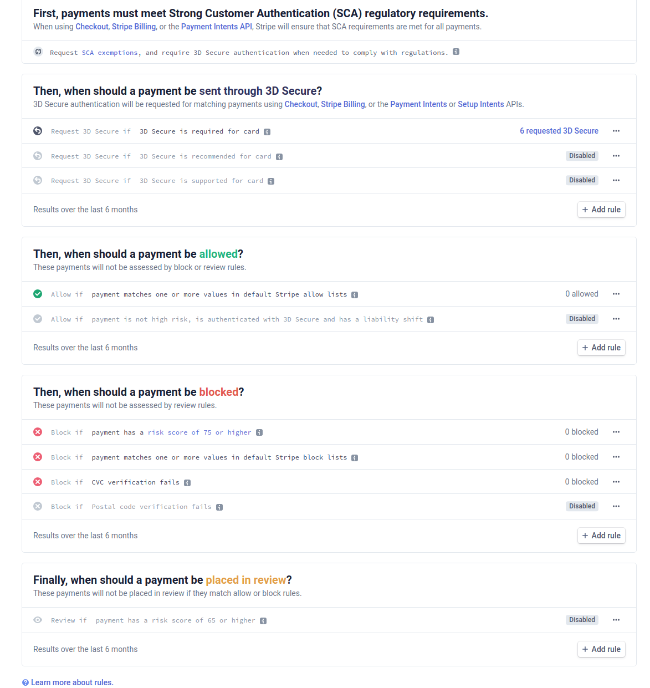

# Stripe

## Porady

### Zwroty

>Always attempt to refund card payments through Stripe and not using another method (e.g., cash or check). If a payment is found to be fraudulent and a dispute is received, you can lose both the disputed amount and the amount you refunded separately.

[refunds](https://stripe.com/docs/refunds)

### Kod pocztowy i adres rozliczeniowy

> Always collect a postal code to increase card acceptance rates and reduce fraud.

>Pass additional billing details, such as the cardholder name and address, to the billing_details hash. The card Element automatically sends the customer’s postal code information. However, combining cardNumber, cardCvc, and cardExpiry Elements requires you to pass the postal code to billing_details[address][postal_code].

[Save a card during payment](https://stripe.com/docs/payments/save-during-payment)

### Radar rules

> A payment can still be successful even if the CVC or postal code check fails. This is because card issuers take many signals into account when making a decision about whether to approve or decline a payment. In some cases, a card issuer may still approve a payment they consider legitimate, even if the CVC or postal code verification check fails.

> Stripe has built-in rules so you can block payments even if they’ve been approved by the card issuer. These rules can be enabled or disabled using the Stripe Dashboard.

[Radar rules](https://stripe.com/docs/radar/rules#traditional-bank-checks)



### Team member

Funckja team member umożliwia nam dodanie dodatkowych osób do zarządzania kontem Stripe. Za pomocą takiego konta możemy pomóc w konfiguracji webhooków i wygenerowaniu kluczy API.

[Invite team members or developers to access your Stripe account](https://support.stripe.com/questions/invite-team-members-or-developers-to-access-your-stripe-account)

[Settings team](https://dashboard.stripe.com/settings/team)

## Płatność off-session

```
try {
  \Stripe\PaymentIntent::create([
    'amount' => 1099,
    'currency' => 'usd',
    'customer' => '{{CUSTOMER_ID}}',
    'payment_method' => '{{PAYMENT_METHOD_ID}}',
    'off_session' => true,
    'confirm' => true,
  ]);
} catch (\Stripe\Exception\CardException $e) {
  // Error code will be authentication_required if authentication is needed
  echo 'Error code is:' . $e->getError()->code;
  $payment_intent_id = $e->getError()->payment_intent->id;
  $payment_intent = \Stripe\PaymentIntent::retrieve($payment_intent_id);
}
```

Kiedy mamy już identyfikator klienta i metody płatności, utworzenie płatności off-session nie jest bardziej złożone od płatności on_session. Musimy tylko ustawić dwa dodatkowe atrybuty: `off_session` i `confirm`.

Ustawiając `off_session` na wartość `true` informujemy że klient nie jest w trakcie realizacji transakcji, więc zostanie zwrócony błąd jest potrzebna dodatkowa autoryzacja.

Zaś ustawiając `confirm` na `true` powoduje że potwierdzenie nastąpi natychmiast po utworzenie PaymentIntent.

[Charge the saved card later](https://stripe.com/docs/payments/save-during-payment#web-create-payment-intent-off-session)
