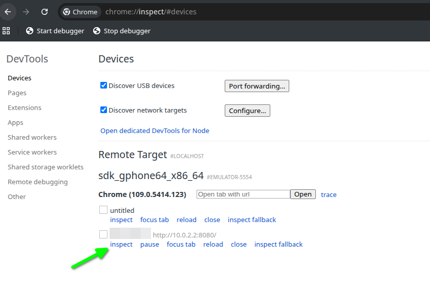

# Testowanie aplikacji webowej na emulatorze Android

W jednym z projektów chciałem sprawdzić działanie aplikacji internetowej na telefonie z systemem Android.
Zamiast wystawiać aplikację do Internetu za pomocą narzędzia takiego jak ngrok, postanowiłem skorzystać z emulatora Android.

Na komputerze miałem już zainstalowany Android SDK oraz skonfigurowane wirtualne urządzenie.
Jednak podczas uruchamiania polecenia `avdmanager list device`  otrzymałem błąd:

>Error: A JNI error has occurred, please check your installation and try again
Exception in thread "main" java.lang.UnsupportedClassVersionError: com/android/sdklib/tool/AvdManagerCli has been compiled by a more recent version of the Java Runtime (class file version 61.0), this version of the Java Runtime only recognizes class file versions up to 52.0
       at java.lang.ClassLoader.defineClass1(Native Method)
       at java.lang.ClassLoader.defineClass(ClassLoader.java:756)
       at java.security.SecureClassLoader.defineClass(SecureClassLoader.java:142)
       at java.net.URLClassLoader.defineClass(URLClassLoader.java:473)
       at java.net.URLClassLoader.access$100(URLClassLoader.java:74)
       at java.net.URLClassLoader$1.run(URLClassLoader.java:369)
       at java.net.URLClassLoader$1.run(URLClassLoader.java:363)
       at java.security.AccessController.doPrivileged(Native Method)
       at java.net.URLClassLoader.findClass(URLClassLoader.java:362)
       at java.lang.ClassLoader.loadClass(ClassLoader.java:418)
       at sun.misc.Launcher$AppClassLoader.loadClass(Launcher.java:352)
       at java.lang.ClassLoader.loadClass(ClassLoader.java:351)
       at sun.launcher.LauncherHelper.checkAndLoadMain(LauncherHelper.java:621)

Błąd oznacza, że avdmanager został skompilowany dla nowszej wersji Javy niż ta, która jest aktualnie używana przez system.

Aby sprawdzić, jakie wersje Javy są zainstalowane w systemie Ubuntu, możemy użyć polecenia `update-java-alternatives --list`

Przykładowy wynik:
```
java-1.11.0-openjdk-amd64      1111       /usr/lib/jvm/java-1.11.0-openjdk-amd64
java-1.17.0-openjdk-amd64      1711       /usr/lib/jvm/java-1.17.0-openjdk-amd64
java-1.21.0-openjdk-amd64      2111       /usr/lib/jvm/java-1.21.0-openjdk-amd64
java-1.8.0-openjdk-amd64       1081       /usr/lib/jvm/java-1.8.0-openjdk-amd64
```

Domyślną wersję Javy można zmienić poleceniem `sudo update-alternatives --config java`.

Alternatywnie w systemie Ubuntu można użyć `sudo update-java-alternatives --set <sciezka/do/nowszej/wersji/javy>`

### Dostęp do aplikacji uruchomionej na komputerze gospodarza

Emulator Android udostępnia specjalny adres IP 10.0.2.2, który wskazuje komputer gospodarza (host).
Jeżeli aplikacja działa niezależnie od wartości nagłówka Host, wystarczy w emulatorze otworzyć adres: `http://10.0.2.2:<port>`

Jeżeli jednak aplikacja obsługuje tylko określone nazwy hostów, warto skorzystać z usługi nip.io i skonfigurować serwer HTTP tak, aby nasłuchiwał również na odpowiednich aliasach.

Mając skonfigurowane urządzenie "pixel_6_pro", uruchamiamy je poleceniem `emulator -avd "pixel_6_pro"`

Jeżeli podczas uruchamiania pojawi się błąd:

> MESA: error: X error: 11
XIO:  fatal IO error 9 (Bad file descriptor) on X server ":0"
     after 5654 requests (5653 known processed) with 0 events remaining.
Segmentation fault (core dumped)

możemy spróbować uruchomić emulator poleceniem `emulator -avd "pixel_6_pro" -gpu swiftshader_indirect -verbose`

### Reverse proxy z wykorzystaniem mitmproxy

Możemy również uruchomić serwer reverse proxy, który będzie przekazywał ruch HTTP do aplikacji i jednocześnie zmieniał nagłówek Host.

`mitmproxy` obsługuje tryb reverse, jednak nie posiada wbudowanego mechanizmu do modyfikowania nagłówka Location w odpowiedzi HTTP.
W tym celu należy przygotować własny skrypt (rewrite_location.py):

```
from mitmproxy import http

OLD_HOST = "admin.lvh.me"
NEW_HOST = "10.0.2.2:8080"

def response(flow: http.HTTPFlow):
    location = flow.response.headers.get("Location")

    if location and OLD_HOST in location:
        flow.response.headers["Location"] = location.replace(
            OLD_HOST,
            NEW_HOST
        )

```

Następnie uruchamiamy kontener Docker z mitmproxy:
```
docker run --network=host --rm -it -v ~/.local/mitmproxy:/home/mitmproxy/.mitmproxy -v $(pwd)/rewrite_location.py:/home/mitmproxy/rewrite_location.py mitmproxy/mitmproxy \
mitmweb --web-host 0.0.0.0  --set web_password=secretpassword --mode reverse:http://admin.lvh.me -s /home/mitmproxy/rewrite_location.py
```

Po uruchomieniu emulatora otwieramy w przeglądarce Chrome adres `10.0.2.2:8080`.
Strona naszej aplikacji powinna zostać poprawnie załadowana.

### Debugowanie Chrome na emulatorze

Do przeglądarki Chrome działającej na emulatorze można podłączyć się z poziomu Chrome uruchomionego na komputerze gospodarza za pomocą Chrome DevTools.

Najpierw sprawdzamy, czy emulator jest widoczny przez adb `adb devices`.

Powinniśmy zobaczyć wynik podobny do:

```
List of devices attached
emulator-5554 device
```

Następnie w przeglądarce Chrome na komputerze gospodarza otwieramy adres: `chrome://inspect/#devices`.

Na liście urządzeń powinien pojawić się uruchomiony emulator.
Kliknięcie przycisku Inspect otworzy Chrome DevTools dla przeglądarki działającej na emulatorze.


