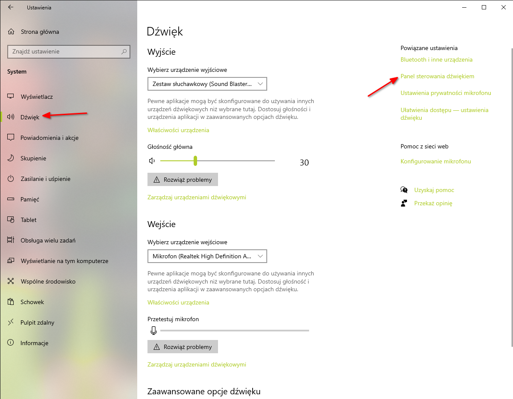

# Windows

## Przydatne aplikacje

`NoxPlayer` - emulator systemu operacyjnego Android

`Anvil’s Storage Utilities` - narzędzie przeznaczone do testowania wydajności dysków twardych/SSD

`SyncDroid` - migracja danych miedzy telefonami Android

`Minitool Partition Wizard` - Obecnie funkcja migracji systemu Windows na nowy dysk ("Migrate OS to SSD/HD Wizard") wymaga płatnej wersji.

`Chocolatey` - [Menedżer pakietów dla Windows](https://chocolatey.org/)

## PortableApps

`KiTTY Portable` - telnet and SSH with added features

`Mozilla Firefox, Portable Edition` - the award-winning web browser that's safe and secure`

`Telegram Desktop Portable` - secure instant messaging

`Shotcut Portable` - full-featured video editor

`VLC Media Player Portable` - An easy to use media player that plays many formats

`LibreOffice Portable` - word processor, spreadsheet, presentations with excellent compatibility

`7-Zip Portable` - File archiver and compressor

`ccPortable (Freeware)` - assists with running CCleaner® portably

`CPU-Z Portable (Freeware)` - system profiler

`CrystalDiskInfo Portable` - disk health monitoring tool

`CrystalDiskMark Portable` - disk benchmark utility

`GPU-Z Portable (Freeware)` - graphics system profiler

`Gridy Portable` - snap your open windows to a grid

`rcvPortable (Freeware)` - file recovery with Recuva®

`specPortable (Freeware)` - system information tool with Speccy®

`SSD-Z Portable (Freeware)` - SSD information tool

`DUMo Portable (Freeware)` - update local drivers

## Porady

`diskmgmt.msc` - Konsola do zarządzania dyskami

`tpm.msc` - Konsola w której sprawdzimy czy nasz komputer wspiera moduł TPM i jeśli tak to w jakiej wersji. [Włączanie tpm 2.0 na komputerze](https://support.microsoft.com/pl-pl/windows/w%C5%82%C4%85czanie-tpm-2-0-na-komputerze-1fd5a332-360d-4f46-a1e7-ae6b0c90645c)

Bitlocker nie jest dostępny w systemach Windows Home. W wyszukiwarce Windows wpisujemy `bitlocker`, aby przejść do ustawień Bitlocker.

Za pomocą polecenia `wmic path softwareLicensingService get OA3xOriginalProductKey` możemy wyświetlić klucz systemu Windows. UWAGA! Te polecenie może nie zwrócić klucza, jeśli posiadamy licencję cyfrową przypisaną do konta Microsoft.

W systemie Windows 10 możemy włączyć dźwięk przestrzenny.
Klikamy na "Start" -> "Ustawienia" -> "System" -> "Dźwięk" -> w sekcji "Powiązane ustawienia" klikamy na "Panel sterowania dźwiękiem".
Następnie wybieramy urządzenie odtwarzania i klikamy na "Właściwości".
W nowo wyświetlonym oknie przechodzimy do zakładki "Dźwięk przestrzenny" i przy polu 
"Format dźwięku przestrzennego" wybieramy pozycję "Windows Sonic" i zatwierdzamy zmiany klikając w przycisk "Zastosuj". [Jak włączyć dźwięk przestrzenny w systemie Windows 10](https://support.microsoft.com/pl-pl/windows/jak-w%C5%82%C4%85czy%C4%87-d%C5%BAwi%C4%99k-przestrzenny-w-systemie-windows-10-ca2700a0-6519-448d-5434-56f499d59c96)



### Lista wszystkich zainstalowanych programów

Uruchamiamy wiersz poleceń jako administrator. Następnie wpisujemy polecenie `wmic`. W powłoce wmic uruchamiamy polecenie `/output C:\sciezka\do\pliku.txt product get name,version`
Plik tekstowy `C:\sciezka\do\pliku.txt` będzie zawierał listę wszystkich zainstalowanych programów w systemie.

### Bootloader

W konsoli wywołujemy poniższe polecenia (potrzebujemy nośniku awaryjnego i wybieramy opcję "Napraw Komputer" -> "Rozwiąż problemy" zamiast "Zainstaluj teraz"):

```
bootrec /FixMbr
bootrec /FixBoot
bootrec /ScanOs
bootrec /RebuildBcd
```

## Skróty klawiaturowe

`Win + Tab` – podgląd pulpitów i aktualnie otwartych okien.

`Win + PrintScreen` – tworzenie zrzutu ekranu i zapisanie go w katalogu Obrazy/Zrzuty ekranu.

## Narzędzia diagnostyczne

### Niezawodność

W wyszukiwarce systemowej wpisujemy "Wyświetl historię niezawodności" albo uruchamiamy "Panel sterowania" -> "System i zabezpieczenia" -> "Zabezpieczenia i konserwacja". Po lewej w menu będzie opcja "Wyświetl zarchiwizowane komunikaty". Klikając na czerwoną kropkę możemy zobaczyć zarejestrowane błędy.

### Wydajność

W wyszukiwarce systemowej wpisujemy "Podgląd zdarzeń". Po prawej stronie klikamy w "Utwórz widok niestandardowy...", a potem zaznaczamy "Według zdarzeń" i obok, na liście "Źródła zdarzeń", wyszukujemy i zaznaczamy "Diagnostic-Performance". Po potwierdzeniu zobaczymy listę z błędami i ostrzeżeniami wywołanymi przez programy, które spowalniają uruchamianie systemu albo nadmiernie go obciążają.

## Naprawianie systemu plików NTFS

Do naprawienia systemu plików możemy użyć Linuxa.
Wywołujemy polecenie `sudo ntfsfix /dev/partycjaDyskuZSystememPlikowNTFS`
Jeśli podczas wywoływania tego polecenia otrzymamy błąd:
> Metadata kept in Windows cache, refused to mount.                                                                                                                                           
> FAILED

To wywołujemy polecenie `sudo ntfs-3g -o remove_hiberfile /dev/partycjaDyskuZSystememPlikowNTFS /mnt/`
Następnie należy odmontować system plików - `sudo umount /mnt`.
Wywołując ponownie polecenie `sudo ntfsfix /dev/partycjaDyskuZSystememPlikowNTFS` otrzymamy:

>Mounting volume... OK
>Processing of $MFT and $MFTMirr completed successfully.
>Checking the alternate boot sector... OK
>NTFS volume version is 3.1.
>NTFS partition /dev/sda2 was processed successfully

Możemy także uruchomić system Windows w trybie awaryjnym i wywołać z konsoli z uprawnieniami administratora polecenie `chkdsk DiskLetter: /f`
