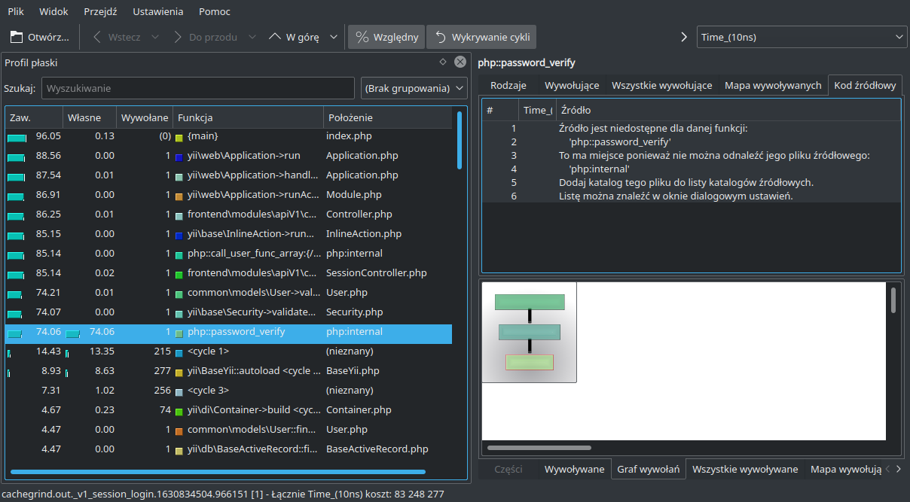

# Xdebug3

## Profiler

Aby uruchomić tryb profilera w Xdebug3 musimy ustawić tryb działania na `profile`.
W przypadku kontenerów Docker możemy ustawić zmienną środowiskową `XDEBUG_MODE` z wartością `profile`.
Dodatkowo zmieniamy nazwę wynikową pliku, aby zawierała ścieżkę żądania HTTP i czas.
Inne modyfikatory są dostępne w [dokumentacji xdebug.trace_output_name](https://xdebug.org/docs/all_settings#trace_output_name).

```
# docker-compose.yaml
services:
  # ...
  php-fpm:
    # ...
    environment:
      XDEBUG_MODE: profile
      XDEBUG_CONFIG: "profiler_output_name=cachegrind.out.%R.%u"
```

Pliki będą zapisywane w katalogu `/tmp`, więc musimy je pobrać z kontenera albo przekopiować je do zamontowanego katalogu.
Następnie możemy wywołać polecenie `kcachegrind cachegrind.out.DALSZA_CZESC_PLIKU `.
W moim przypadku niemal 75% czasu działania zajmuje wbudowana funkcja PHP `password_verify`.



Profilując kod na zdalnym serwerze, nie będziemy mieć takich samych ścieżek do plików. W ustawieniach KCacheGrind musimy dodać katalog z projektem. Otwieramy `Ustawienia` -> `Ustawienia KCachegrind`.
Przechodzimy do zakładki `Komentarze` i dodajemy katalog do `Katalogi źródłowe`. W KCacheGrind jedna jednostka czasu to 1/1 000 000 sekundy.

[Xdebug 3 Profiling: 1. Setting Up](https://www.youtube.com/watch?v=ttQgLBSpVvc)
[Xdebug 3 Profiling: 3. Analysing Data](https://www.youtube.com/watch?v=iH-hDOuQfcY)

## Debug

```
# docker-compose.yaml
services:
  # ...
  php-fpm:
    # ...
    environment:
      # jesli chcemy odpalić funkcje xdebug przy kazdym żądaniu HTTP
      XDEBUG_TRIGGER: "whatever"
      XDEBUG_MODE: develop,debug
      XDEBUG_CONFIG: "client_host=${MY_IP:-172.17.0.1} discover_client_host=0 client_port=9000"
      PHP_IDE_CONFIG: "serverName=${DEV_SERVER_NAME:-domain.lvh.me}"
```
